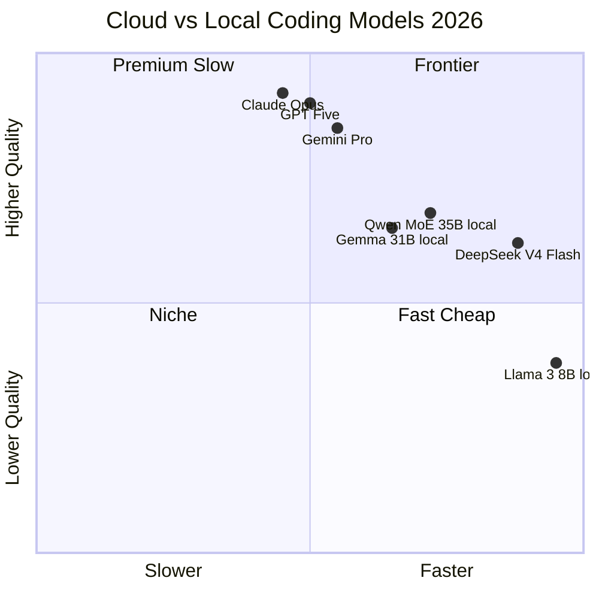

## 1년 전이면 농담이었던 질문

해커뉴스에 며칠 전 올라온 질문 하나가 6월 15일 기준 431점, 댓글 233개로 톱에 박혀 있다. 제목은 *"Claude/GPT를 로컬 모델로 완전히 대체한 사람 있나요?"*. 사이드 실험 말고, 일상 코딩의 메인 도구로 바꿨냐는 것.

1년 전 같은 질문이 올라왔다면 답글은 "안 됩니다, 클라우드 모델이 너무 앞서요"가 대부분이었다. 지금은 다르다. 진지한 셋업 공유가 줄을 잇는다. Qwen 3.6 35B, Gemma 4 31B, DeepSeek V4 Flash를 듀얼 RTX 3090이나 Mac Studio 128GB에 올려 *메인 도구로* 쓴다는 사람들이 한두 명이 아니다.

오픈소스 코딩 모델이 따라잡았다는 얘기는 그동안에도 있었다. 이번에 달라진 건 그 따라잡은 모델이 **컨슈머급 하드웨어에 들어간다**는 점이다.

## 무엇이 바뀌었나

답변자들이 공유한 셋업을 모아보면 패턴이 보인다.

**모델 측에서는 MoE 아키텍처가 대세다.** MoE(Mixture of Experts, 입력마다 전체 파라미터 중 일부 "전문가" sub-network만 활성화하는 아키텍처)는 총 파라미터가 35B여도 추론 시 3B만 깨운다. Qwen 3.6 35B-A3B가 대표적인데, "35B 모델"의 지능을 "3B 모델"의 속도로 돌릴 수 있다는 뜻이다. dense 모델(모든 파라미터가 매 입력에 활성화되는 전통 아키텍처)로 동급 품질을 내려면 훨씬 더 큰 VRAM(GPU 전용 메모리)이 필요했다.

**양자화 기법도 한 단계 깊어졌다.** 양자화(quantization, 모델 가중치를 더 적은 비트로 압축해 메모리·속도를 개선하는 기법)는 Q4(4비트), Q8(8비트) 같은 옵션을 제공한다. Q4_KM 양자화로 Qwen 3.6 35B를 단일 RTX 3090(VRAM 24GB)에 올려 q4@176k 컨텍스트에서 50-70 tok/s(초당 생성 토큰 수)로 돌린다는 보고가 여럿이다. 1년 전 같은 모델이 같은 카드에서 멈춰 죽었던 걸 떠올리면 격세지감이다.

**툴체인도 성숙했다.** llama.cpp(CPU·GPU 모두 지원하는 경량 오픈소스 LLM 추론 엔진)와 OpenCode, pi 같은 코딩 하네스(에디터·셸·테스트를 LLM에 연결해주는 도구)가 로컬 모델을 1급 시민으로 받아들이기 시작했다. "모델만 잘 돌아가도 도구가 후져서 못 썼다"던 옛 문제가 줄었다.

## 하지만 같지는 않다

스레드에서 가장 많이 박힌 표현은 "as smart as Claude Code? No. Good enough for 90% of my work? Yes." 솔직한 평가다.

- **코딩 정확도**: Claude Opus·GPT-5와 비교해 일발 정답률은 분명 낮다. 댓글 하나가 "로컬은 8-12개월 전 frontier 모델 수준"이라고 짚었는데, 다수가 동의한다.
- **에이전트 안정성**: 도구 호출, 멀티스텝 reasoning(추론을 여러 단계로 쪼개 푸는 능력)에서 자주 흔들린다. 작업이 길어질수록 누적 오류가 커진다.
- **하이브리드가 현실적**: 흥미로운 패턴 하나 — Opus로 계획을 짜고, 로컬 Qwen이 그 계획을 실행하고, 다시 Opus가 검증하는 구조. "100% 로컬"이 목표가 아니라 비싼 호출을 줄이는 게 목표인 사람들이 점점 늘고 있다.

## 누가 옮겼고, 왜 옮겼나

옮긴 사람들이 든 이유 세 가지가 반복된다.

1. **프라이버시**. 클라이언트 코드·내부 문서를 외부 API에 보낼 수 없는 상황. 의료·금융·법무 쪽 댓글이 눈에 띈다.
2. **월 구독료**. "$100/월 Claude 구독을 끊었다"는 표현이 여러 번. 듀얼 3090 구입비를 2-3년 안에 회수한다고 본다.
3. **오프라인 작업과 통제**. 인터넷 안 되는 환경, 또는 모델 버전이 갑자기 바뀌면 워크플로가 깨지는 걸 싫어하는 시니어 개발자.

반대로 옮기지 않은 쪽 이유도 명확하다. *"기회비용이 너무 크다"*. 매달 나오는 frontier 모델 업데이트를 놓치면 그만큼 생산성이 빠진다는 계산이다. 댓글 하나가 정확히 짚었다 — "매달 다시 비교해보지만 결론은 같다. 아직 안 옮긴다."

## 의미

"로컬로 옮길 수 있나"라는 질문이 진지해졌다는 것 자체가 흐름의 변화다. 1년 전엔 yes/no 질문이었고 답은 no였다. 지금은 *어떤 작업이냐*, *얼마나 자주 frontier 품질이 필요하냐*가 먼저 와야 답이 나온다.

오픈소스가 8-12개월 격차로 따라붙는 패턴이 이어지면, 내년 이맘때 "frontier 코딩은 클라우드"라는 디폴트도 흔들릴 수 있다.

## 출처

- HN 스레드: [Ask HN: Has anyone replaced Claude/GPT with a local model for daily coding?](https://news.ycombinator.com/item?id=48542100) (2026-06-15, 431점, 댓글 233)
- 로컬 셋업 실사례 (pi + Qwen 3.6 35B-A3B): [pierotofy/LocalCodingLLM](https://github.com/pierotofy/LocalCodingLLM)
- llama.cpp: [https://github.com/ggerganov/llama.cpp](https://github.com/ggerganov/llama.cpp)
