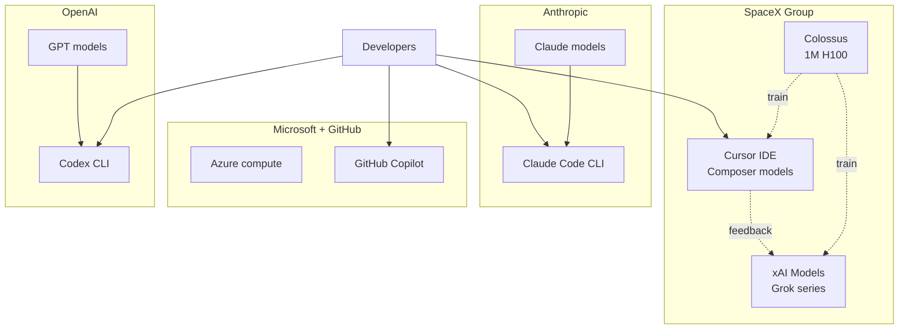

2026년 6월 16일, SpaceX가 AI 코딩 도구 회사 Anysphere(제품명 Cursor)를 600억 달러에 전량 인수한다고 발표했다. 4월에 100억 달러 지분 투자로 시작된 협력이 두 달 만에 완전 합병으로 굳어진 셈이다. Cursor는 개발자가 자연어로 코드를 지시하고 AI가 파일을 수정·실행해 주는 IDE(통합 개발 환경, 코드 편집기와 디버거와 실행기를 한 화면에 묶은 프로그램)로, Anthropic의 Claude Code, OpenAI의 Codex와 함께 "에이전트 코딩"(AI가 사람의 지시를 받아 여러 단계를 스스로 처리하는 방식) 시장의 3대 축으로 꼽혀 왔다.

뉴스의 무게는 가격표 자체에 있다. Cursor의 기업 가치는 2025년 5월 99억 달러에서 11월 293억 달러, 그리고 2026년 6월 600억 달러로 13개월 만에 6배가 됐다. 같은 기간 ARR(Annual Recurring Revenue, 연간 반복 매출 — 구독 기반 회사의 12개월 환산 매출)은 10억 달러를 돌파했다고 보도됐다. 1억 명 단위 사용자를 가진 검색·소셜 회사가 아닌 IDE 한 종에 그 정도 값이 매겨졌다는 사실이 시장 분위기를 압축적으로 보여준다.

## SpaceX가 Cursor에서 사는 것 — 컴퓨트와 데이터의 양방향

피상적으로 보면 우주 회사가 코딩 IDE를 사는 건 부조화다. 하지만 SpaceX는 2026년 2월에 xAI를 흡수했고, 그때 들어온 자산이 "Colossus"라 부르는 H100(NVIDIA의 데이터센터급 GPU, 모델 학습용 표준 칩) 100만 장 규모의 학습 슈퍼컴퓨터다. Cursor의 약점은 정확히 그 컴퓨트였다. 자체 코딩 모델 시리즈(Composer, Composer 1.5, Composer 2)를 내놓으면서 매번 성능이 의미 있게 올라갔지만, 더 큰 모델을 더 자주 돌릴 자원이 부족했다.

반대로 SpaceX 입장에서는 Cursor가 가진 데이터가 매력적이다. 수백만 명의 개발자가 매일 작성하는 코드와 그에 대한 AI의 응답·수정·실패는 "코드 도메인에 특화된 인간 피드백"의 원광이다. 일반 웹 텍스트로 사전학습한 모델과는 별도의 데이터셋으로, RLHF(Reinforcement Learning from Human Feedback, 사람의 선호 데이터로 모델 응답을 다듬는 학습 단계) 단계에서 보상 신호로 직접 쓸 수 있다. 컴퓨트는 SpaceX가, 분포 외 코드 데이터는 Cursor가 들고 있던 셈이고, 이번 인수는 그 둘을 한 회사 안으로 끌어들이는 거래다.

## AI 코딩 시장의 4구도와 수직 통합 신호

이번 거래로 AI 코딩 도구 시장의 경쟁 구도는 더 단순해졌다. 각 진영이 모델·인프라·앱(IDE 또는 CLI)을 어디까지 자기 손으로 들고 있느냐가 핵심 축이다.

- **Anthropic — Claude + Claude Code(CLI)**: 모델과 사용자 도구를 같은 회사가 만든다. 인프라는 AWS·GCP를 임차.
- **OpenAI — GPT + Codex(CLI, 오픈소스 Rust 구현)**: 같은 구조. Microsoft Azure 의존도가 크다.
- **GitHub Copilot — Microsoft 산하**: 모델은 외부 다종(OpenAI·Anthropic·자체), 앱은 자기 IDE 확장. 인프라는 모회사 Azure.
- **SpaceX — xAI 모델 + Colossus 컴퓨트 + Cursor 앱**: 셋을 한 지붕 아래 묶은 첫 사례.

수직 통합이 자동으로 승리를 보장하지는 않는다. 모델 품질만 보면 Anthropic·OpenAI가 아직 앞서 있고, 사용자 충성도와 IDE 사용성은 Cursor·Copilot·Claude Code가 각각 다른 강점을 가진다. 다만 컴퓨트 가격과 학습 데이터가 점점 더 비싸지는 흐름에서, 셋을 다 가진 회사는 가격을 후려쳐 점유율을 빠르게 가져갈 여지가 있다. Cursor 사용자 입장에서 가장 직접적인 변화는 "Composer 시리즈가 갑자기 더 큰 모델로 점프하면서 가격은 그대로거나 더 싸지는" 시나리오다.

## 한국 개발자에게 의미

한국 개인 개발자와 작은 스튜디오가 가장 먼저 체감할 변화는 두 가지다. 첫째, 가격 경쟁이다. SpaceX 산하로 들어간 Cursor가 컴퓨트 마진을 얼마나 양보하느냐에 따라, 월 20달러 안팎이던 AI 코딩 IDE의 표준 가격대가 흔들릴 수 있다. 둘째, 모델 선택 폭이다. Cursor는 지금까지 Anthropic의 Claude와 OpenAI의 GPT를 백엔드로 자유롭게 골라 쓰는 구조였는데, xAI 모델이 기본값으로 바뀌거나 외부 모델 호출에 차등이 생기면 사용자의 의존 모델이 강제로 옮겨질 수 있다. 도구는 그대로인데 그 뒤의 "두뇌"가 달라지는 셈이다.

## 결론

기술 인수 발표 한 줄로 보면 작은 뉴스다. 하지만 이번 거래는 AI 산업이 지금 어디로 가고 있는지를 압축적으로 드러낸다. 모델 회사·컴퓨트 회사·앱 회사가 따로 돌아가던 지난 3년의 구도가 한 지붕 아래로 묶이는 중이고, 그 첫 신호탄을 우주 회사가 쐈다. Anthropic·OpenAI·Microsoft가 어떻게 답하느냐가 다음 분기의 관전 포인트다. 단순히 "또 다른 인수합병"으로 흘려보내기에는 가격표가 너무 크고, 시장 구도가 너무 깔끔하게 단순해졌다.

## 출처

- Reuters, "SpaceX to buy Cursor for $60B" (2026-06-16): https://www.reuters.com/legal/transactional/spacex-buy-anysphere-60-billion-2026-06-16/
- 9to5Mac, "SpaceX Purchases Cursor, a Claude Code and OpenAI Codex Competitor" (2026-06-16): https://9to5mac.com/2026/06/16/spacex-lands-deal-to-likely-purchase-claude-code-and-openai-codex-competitor/
- Pentesty, "SpaceX Acquires Cursor for $60B: What It Means for Software Security" (2026-06-16): https://www.pentesty.co/blog/spacex-acquires-cursor-60-billion-software-security
- Hacker News thread (2026-06-16): https://news.ycombinator.com/item?id=48553224
