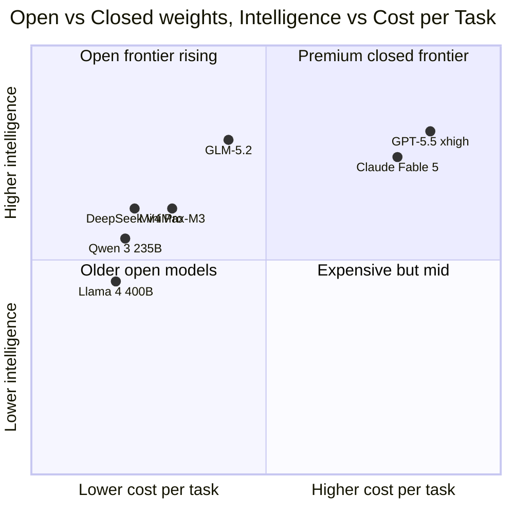

지금까지 "성능 좋은 모델은 비공개, 공개 모델은 그 다음 라인"이라는 구도가 한동안 유지됐다. GPT-5.5나 Claude Fable 같은 비공개(closed weights, 회사 서버에서만 돌고 가중치를 받을 수 없는) 모델이 최상위였고, 그 아래에 DeepSeek·Qwen·Llama 같은 오픈 가중치(open weights, 누구나 다운로드해 자기 GPU에서 돌릴 수 있는) 모델들이 따라가는 형태였다.

이 구도가 어제(6월 16일~17일) 또 한 번 흔들렸다. 중국의 Z AI(구 Zhipu AI, 칭화대 출신 연구자들이 세운 LLM 회사)가 공개한 **GLM-5.2**가 오픈 가중치 모델 중 1위에 올랐고, 종합 지표에서 OpenAI GPT-5.5의 고추론(extra high reasoning) 모드와 사실상 동률을 기록한 것이다.

## 무엇이 바뀌었나

Artificial Analysis(독립 벤치마크 집계 사이트)의 Intelligence Index v4.1 — GDPval-AA·Terminal-Bench·SciCode·HLE 등 9개 평가의 종합 점수 — 기준으로 정리하면 이렇다.

| 모델 | Intelligence Index | 비고 |
|---|---|---|
| GLM-5.2 (max) | **51** | 오픈 가중치 1위, MIT 라이선스 |
| MiniMax-M3 | 44 | 직전 오픈 가중치 1위 |
| DeepSeek V4 Pro | 44 | 6월 초까지 1위였던 모델 |
| GPT-5.5 (extra high) | — | GDPval-AA v2에서 1514점, GLM-5.2(1524)와 동률 |

특히 과학 추론 분야에서 점수 상승이 가팔랐다. CritPt(전문가가 만든 물리·화학 난문제 셋)는 +16점 올라 21%, HLE(Humanity's Last Exam, 인간이 손으로 푼 마지막 난제 모음)는 +12점 올라 40%, SciCode(과학 코드 생성)는 50%까지 올랐다. 이전 세대인 GLM-5.1과 같은 744B/40B 활성 MoE(Mixture of Experts, 입력마다 일부 전문가 sub-network만 활성화되는 아키텍처) 구조에서 학습·후처리만 바꿔 이 정도 폭이 나왔다.

같이 늘어난 게 컨텍스트 길이다. GLM-5.1은 200K였는데 GLM-5.2는 **1M 토큰**으로 5배 늘렸다. 한 번에 책 한 권에서 책 다섯 권 분량이 됐다는 뜻인데, 오픈 가중치 모델이 1M에 도달한 건 흔치 않은 케이스다.

## 그래서 어떻게 받아들여야 하나

세 가지 결이 같이 본다.

**첫째, 오픈 vs 비공개 격차가 다시 좁혀졌다.** 작년 이맘때까지만 해도 비공개 최상위와 오픈 최상위 사이에 종합 점수로 5-10점 차이가 벌어져 있었다. GLM-5.2는 GPT-5.5의 가장 무거운 추론 모드(extra high)와 동률을 만들었다. "비싼 비공개 모델만이 풀 수 있는 문제"의 범위가 다시 좁아지는 셈이다.

**둘째, 중국 MoE 라인업의 누적 효과.** DeepSeek V4·V4 Pro, Qwen 시리즈, MiniMax-M3, 그리고 이번 GLM-5.2까지 — 중국 진영의 오픈 가중치 MoE 모델이 6개월 만에 또 한 칸씩 올라갔다. 각각의 회사가 다른 분야를 노렸음에도(DeepSeek은 코딩·가격, MiniMax는 멀티모달, GLM은 과학 추론) 결과적으로 오픈 진영 전체의 상한선이 올라가는 모양새다.

**셋째, 토큰 효율은 여전히 약점.** GLM-5.2는 같은 태스크를 풀 때 평균 출력 토큰 43k(그중 37k가 reasoning 토큰)를 쓴다. 답이 같아도 더 길게 생각해서 더 많이 출력하므로, 입력 100만 토큰당 $1.40 / 출력 100만 토큰당 $4.40 가격에도 태스크당 비용이 ~$0.46 정도로 올라간다.

## 라이선스가 진짜 핵심

벤치마크 숫자도 중요한데, 실무 입장에서는 **MIT 라이선스**가 더 큰 의미일 수 있다. 가중치를 그대로 받아 자기 회사 GPU에서 돌리고, 자기 제품에 붙이고, 추가 학습해서 재배포하는 게 다 허용된다. Llama 라이선스에 붙어 있는 월간 활성 사용자(MAU) 7억 상한 같은 제약도 없다.

비공개 모델 API에 의존하던 한국 스타트업들에게는 갈림길이 생긴다. 비공개 가격이 떨어지길 기다리거나, 오픈 가중치를 자기 인프라에 올리거나. GPU 임대·운영비가 있어 단순 비교는 안 되지만, 데이터 주권·외부 API 의존 리스크·한국어 미세조정 같은 변수가 더해지면 결정이 달라진다. "최상위 모델 = 비공개 API"라는 자동 가정이 적어도 종합 추론 작업에서는 무너지고 있다는 게 이번 발표의 메시지다.

## 출처

- [GLM-5.2 is the new leading open weights model on Artificial Analysis (2026-06-17)](https://artificialanalysis.ai/articles/glm-5-2-is-the-new-leading-open-weights-model-on-the-artificial-analysis-intelligence-index)
- [GLM 5.2 Performance Benchmarks — Artificial Analysis](https://artificialanalysis.ai/models/glm-5-2)
- [HN 토론](https://news.ycombinator.com/) — 6월 17일 GLM-5.2 발표 직후 frontpage 상위
