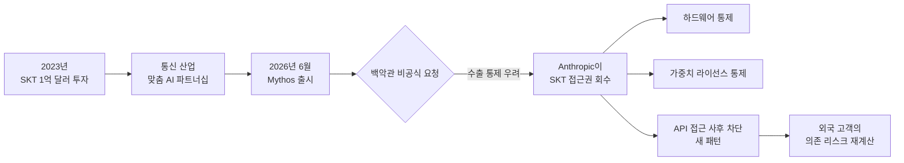

미국 정부가 한국 1위 통신사 SK텔레콤의 Anthropic Mythos 사용 권한을 사실상 끊었다. 백악관이 Anthropic에 "SK텔레콤의 Mythos 접근을 회수하라"고 비공식 요청했고, 회사는 곧바로 응했다. Wired가 이 사실을 보도하면서 이번 주 영문 IT 매체와 Hacker News에서 단숨에 화제가 됐다.

단순한 회사·모델 이슈가 아니다. **민간 AI 회사가 정부의 한 통 요청에 외국 대기업 한 곳의 접근권을 차단한 첫 공개 사례**다. 그동안 AI 수출 통제는 "GPU 못 판다"는 하드웨어 차원이었는데, 이제 "특정 외국 고객은 우리 모델을 못 쓴다"는 소프트웨어 레이어로 내려왔다. 한국에서 영향을 받는 첫 기업이 한국 통신 1위라는 점에서, 이 사건은 한국 독자에게도 결코 멀지 않다.

## 무슨 일이 벌어졌나

Wired 보도와 Hacker News 토론을 종합하면 흐름은 이렇다.

- **2023년**: SK텔레콤이 Anthropic에 약 1억 달러를 투자했다. 단순 재무 투자가 아니라, 통신 산업에 특화된 AI 모델을 함께 개발하기로 한 상업적 파트너십과 결합돼 있었다.
- **2026년 봄**: Anthropic이 새 플래그십 모델 Mythos를 출시했다. ([본 매거진 6월 10일 글](/posts/2026-06-10-claude-fable-5-mythos-5-new-tier/) 참조)
- **2026년 6월**: 백악관이 Anthropic에 SK텔레콤의 Mythos 접근권 회수를 요청. 회사는 즉시 응했다.
- **공식 사유 미공개**: Wired는 "수출 통제와 관련된 우려"라고만 전했고, 구체적인 위반 사항·증거는 공개되지 않았다.

Hacker News 토론에서는 다른 각도도 나왔다. 일부 코멘트는 "SK텔레콤 이슈는 Fable 출시 이전에 이미 해결된 건이고, 진짜 도화선은 다른 곳에 있다"고 주장한다. 어느 쪽이든, 결론은 같다 — **백악관이 요청하면 미국 AI 회사는 외국 고객 한 곳의 접근을 끊을 수 있다는 것이 공식적으로 확인된 첫 사례**가 됐다.

## 왜 이게 구조적 변화인가

지금까지 AI 분야의 수출 통제는 두 층이었다.

1. **하드웨어 층**: NVIDIA H100·H200 같은 첨단 GPU의 중국·러시아 수출 제한.
2. **모델 가중치 층**: 미국 정부가 prefer하는 라이선스(예: 폐쇄 가중치)를 통해 frontier 모델의 외부 유출을 제한.

이번 사건은 세 번째 층을 추가한다.

3. **API 접근 층**: 모델을 외국에 "팔지 않는" 게 아니라, "쓸 수 있던 외국 고객의 사용권을 뒤늦게 회수한다." 마치 SaaS 계정을 정지시키는 것과 같다.

이 차이는 작지 않다. 하드웨어 통제는 "공장에서 못 나가게 한다"는 사전 차단이지만, API 접근 통제는 **이미 통합된 시스템을 사후에 끊는다**. SK텔레콤이 Mythos를 사내 어떤 시스템에 어떻게 엮어놨든, 그것이 하루 아침에 멈춘다는 뜻이다. 외국 고객 입장에서 미국 AI에 대한 의존은 이제 "비용·성능 vs 정치적 단절 리스크"라는 새 변수까지 끌고 가게 된다.

## 한국 시장에 던지는 질문

SK텔레콤은 한국 통신 산업의 정점에 있고, 국내 AI 인프라(에이닷·에이블 등 자체 AI 서비스)와 외국 frontier 모델을 함께 굴려왔다. 이번 차단으로 잃는 게 정확히 무엇인지는 아직 공개되지 않았지만, 구조적 신호는 명확하다.

- **외국 frontier 모델 의존도가 높을수록 정치 리스크가 커진다.** GPT, Claude, Gemini를 사내 핵심 워크플로에 박아둔 한국 기업이라면, "백악관 한 통이 어느 날 우리 운영을 멈출 수 있다"는 가능성을 시나리오에 넣어야 한다.
- **오픈 가중치(open-weights, 가중치를 공개해 누구나 직접 돌릴 수 있게 한 모델) 대안의 가치가 올라간다.** DeepSeek, Meta Llama, Mistral, GLM 등 자체 호스팅 가능한 모델은 정치적 차단 면역도가 다르다. 어제 본 매거진의 [GLM-5.2 글](/posts/2026-06-18-glm-5-2-open-weights-tops-frontier/)에서 다룬 흐름과 같은 맥락이다.
- **국산 foundation 모델의 전략적 가치가 재평가된다.** 네이버 HyperCLOVA, 카카오 KoGPT, LG EXAONE 같은 국내 사업자의 모델은 "성능 1위 경쟁"이라는 잣대만으로는 평가가 끝나지 않는다. 정치적 단절 가능성을 헷지하는 옵션 가치까지 따져야 한다.

## 한 장 요약

## 결론 — "API는 영구 자산이 아니다"

지난 3년간 한국·일본·유럽 기업들은 미국 AI를 마치 클라우드·전기처럼 "결제만 하면 무한히 흐르는 인프라"로 다뤄왔다. 이번 사건은 그 전제를 흔든다. **frontier 모델은 인프라가 아니라 외교적 자산**이라는 사실이 공식 확인된 것이다.

흥미로운 후속 질문은 두 가지다. 첫째, Anthropic이 이번에 "정부 요청이 들어오면 우리는 응한다"는 신호를 보낸 만큼, 다른 미국 AI 회사(OpenAI, Google, Meta)도 같은 압박에 같은 방식으로 응할 것인가. 둘째, 한국 정부와 한국 기업은 이 사례를 단발 이벤트로 볼 것인가, 아니면 자체 frontier 역량과 오픈 가중치 인프라 투자의 트리거로 삼을 것인가. 답이 나오는 데는 길어도 6개월이면 충분할 것 같다.

## 출처

- [The Korean telecom giant at the center of Anthropic's Mythos controversy — Wired](https://www.wired.com/story/sk-telecom-anthropic-mythos-export-controls/)
- [Hacker News 토론 — 2026-06-18](https://news.ycombinator.com/item?id=48584484)
- [본 매거진 — Mythos·Fable 새 티어 출시](/posts/2026-06-10-claude-fable-5-mythos-5-new-tier/)
- [본 매거진 — GLM-5.2 오픈 가중치](/posts/2026-06-18-glm-5-2-open-weights-tops-frontier/)
