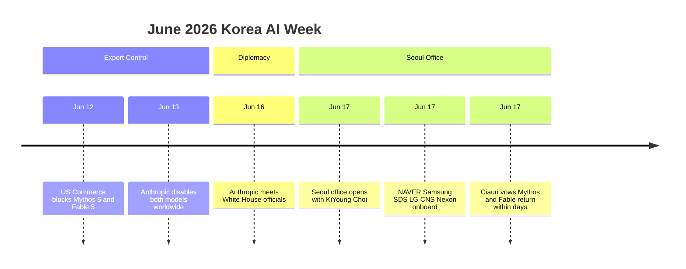

6월 17일 Anthropic — Claude를 만드는 미국 AI 회사 — 가 서울에 정식 사무실을 열었다. 도쿄·벵갈루루에 이은 아시아·태평양 세 번째 거점이다. 이번 발표의 무게는 사무실 자체보다 같이 공개된 한국 대기업 도입 명단의 폭에 있다. NAVER 엔지니어링 조직 전체, 삼성SDS·LG CNS 그룹 전체, 넥슨의 라이브 서비스 게임 개발, 한화솔루션, 채널코퍼레이션의 메신저 — 한국 IT 핵심 영역이 한 번에 들어왔다.

같은 주의 다른 사건도 같이 봐야 한다. 닷새 전 6월 12일, 미국 상무부가 Anthropic의 최상위 두 모델 — Claude Mythos 5(현재 가장 능력 높은 추론 모델)와 Claude Fable 5(차세대 자율 에이전트 모델) — 에 대해 외국 국적자 접근을 전 세계 차단하라는 directive(행정 명령)을 내렸다. 어제 이 매거진에서 [그 흐름의 시작이 된 SK텔레콤 Mythos 회수 사건](/posts/2026-06-19-sk-telecom-mythos-export-control/)을 다뤘다. 한쪽은 한국에 깊이 들어오고, 다른 쪽은 톱 모델을 막은 셈이다. 이 모순이 오늘 발표의 맥락이다.

## 한국 산업 핵심에 한 번에 박았다

명단의 폭이 의미다.

- **NAVER**: 엔지니어링 조직 전체에 Claude Code(Anthropic의 코딩 보조 에이전트) 도입.
- **삼성SDS**: Claude Cowork(팀 협업 라인)와 Claude Code를 삼성전자 전사에 배포.
- **LG CNS**: LG 그룹 전체에 Claude 배포.
- **넥슨**: 라이브 서비스 게임 개발에 Claude Code 적용.
- **한화솔루션**: AWS Bedrock(AWS의 AI 모델 호스팅 서비스) 위에서 한국 region(국가 내 데이터 저장) 옵션으로 도입.
- **채널코퍼레이션**: 전 세계 23만+ 사업장이 쓰는 Channel Talk 메신저의 응대·요약 코어에 Claude.

여기에 SK텔레콤·Naver Cloud와의 추가 협업이 진행 중이고, 정부 쪽으로는 과학기술정보통신부와 MOU(양해각서)를 체결했다. KAIST·고려대·연세대·POSTECH가 참여하는 국가 AI 연구실 컨소시엄 소속 연구자 최대 60명에게 Claude를 무상 제공한다는 항목도 포함됐다. 사무실 개소라기보다 한국 AI 인프라에 깃발을 꽂는 단계의 발표다.

자본 라인에서도 신호가 있다. 삼성전자와 SK하이닉스가 최근 Anthropic 전략 투자 라운드에 새로 참여했다. 시장 위치를 짧게 압축하면 — KED Global 보도 기준 한국 유료 생성 AI 시장에서 Claude가 2026년 들어 처음으로 ChatGPT를 추월했고, 지난 1년 새 Anthropic의 한국 사용량이 3.5배 이상 늘었다. 이 시점에 서울 사무실을 여는 건 시장 점유율 확정의 마무리 동작으로 읽힌다.

## 한국 대표는 KiYoung Choi

서울 대표는 KiYoung Choi 전 Snowflake Korea(데이터 클라우드 회사) 총괄이 맡았다. Snowflake가 한국 대기업 CIO 라인을 직접 영업해 빠르게 자리잡았던 톱다운 방식이 그대로 적용될 가능성이 크다. Anthropic의 한국 전략은 개발자 풀뿌리(GitHub Copilot 식)도, 일반 소비자(ChatGPT 식)도 아닌, **B2B 엔터프라이즈 톱다운**으로 정의됐다.

## 수출 통제와의 묘한 동시성

같은 주 6월 12일 directive 한 줄로 흐름이 꼬였다. AI 모델 자체에 수출 통제가 적용된 첫 사례다 — 그동안 GPU·반도체 같은 하드웨어에만 걸리던 통제가 처음으로 모델 SaaS에 적용됐다. Anthropic은 실시간 국적 검증이 불가능하다는 이유로 전 세계 모든 고객에게서 두 모델을 일시 중단했고, AWS·Google Cloud Vertex AI·Microsoft Foundry·GitHub Copilot에서도 Fable 5 접근이 동시에 닫혔다. 차단되지 않은 Opus 4.8 등 일반 라인업은 정상이라 일상 작업에는 영향 없지만, 가장 어려운 추론·차세대 에이전트 시나리오는 보류 상태다.

흐름이 묘한 건 이 directive와 서울 발표가 같은 주에 한국 언론에 동시에 실렸다는 점이다. Anthropic International 총괄 Chris Ciauri가 서울 기자회견에서 "며칠 안에 복구된다"고 말한 자리 자체가, 이번 사무실 개소가 정치적 신뢰 회복까지 함께 해내야 했음을 보여준다.

## 흐름 정리

## 결론

같은 주의 두 사건은 한국 AI 시장이 어디 서 있는지 보여준다. 한쪽에서는 Anthropic 같은 frontier(최전선) AI 회사가 한국 산업 핵심 — 통신·반도체·인터넷·게임·SaaS — 의 큰 이름을 한 번에 영업해 들어오고, 다른 쪽에서는 미국 정부가 그 회사의 톱 라인을 며칠 단위로 막았다 풀었다 한다. NAVER 엔지니어의 일상 코딩이 멈출 일은 없겠지만, **차세대 모델은 매번 정치적 조건과 묶여서 들어온다**. frontier 의존을 일상 인프라와 톱 라인으로 분리할지, 톱 라인 의존을 헷지할 자체 인프라(국산 foundation 모델·오픈 가중치 자체 호스팅)를 어느 비율로 가져갈지 — 이번 주가 그 질문을 더 이상 학술적이지 않은 영역으로 끌어내렸다.

## 출처

- [Anthropic — Anthropic opens Seoul office and announces new partnerships across the Korean AI ecosystem](https://www.anthropic.com/news/seoul-office-partnerships-korean-ai-ecosystem)
- [Anthropic — Statement on the US government directive to suspend access to Fable 5 and Mythos 5](https://www.anthropic.com/news/fable-mythos-access)
- [CNBC — Anthropic disables access to Fable 5 and Mythos 5 to comply with government directive](https://www.cnbc.com/2026/06/12/anthropic-disables-access-to-fable-5-and-mythos-5-to-comply-with-government-directive.html)
- [Korea JoongAng Daily — Anthropic confident of reenabling Mythos, Fable 5 access in coming days](https://www.koreajoongangdaily.com/business/anthropic-confident-of-reenabling-mythos-fable-5-access-in-coming-days-executive/12727522)
- [KED Global — Korea emerges as global AI battleground as Anthropic launches Seoul office](https://www.kedglobal.com/artificial-intelligence/newsView/ked202606180004)
- [TechTimes — Fable 5 Export Ban Day Six: Anthropic Opens Seoul Office](https://www.techtimes.com/articles/318668/20260618/fable-5-export-ban-day-six-anthropic-opens-seoul-office-vows-models-back-days.htm)
