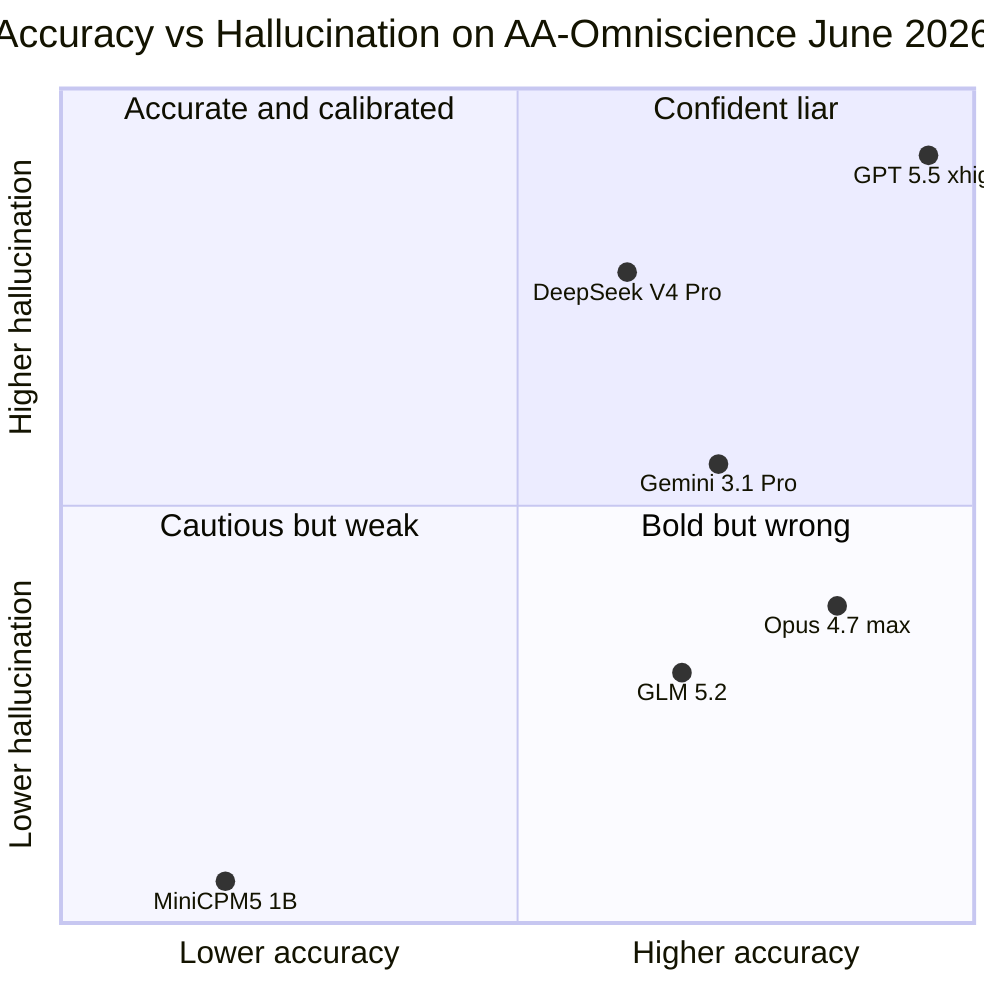

AI 모델에 "모르는 걸 물어보면 어떻게 답할까?"라고 묻는다고 해 보자. 사람이라면 "잘 모르겠는데요"가 정답에 가깝다. 그런데 최신 대형 모델은 그 자리에서 그럴듯한 거짓말을 만들어 답한다. 이걸 환각(hallucination, 사실이 아닌 내용을 사실처럼 답하는 현상)이라고 부른다.

지난 한 주 사이 Hacker News·X·여러 벤치마크 분석 글에서 같은 숫자가 동시에 회자됐다. **GPT-5.5가 정확도 1위를 기록한 바로 그 평가에서, 환각률도 86%로 1위였다.** 정확도를 끌어올리는 동안 "모른다고 말하는 능력"이 같이 무너졌다는 뜻이다.

## 86%가 정확히 뭘 의미하나

먼저 숫자부터 풀자. AA-Omniscience(Artificial Analysis Omniscience, 6개 도메인 42개 경제적 주제에 걸친 6,000개 질문으로 모델의 사실 인식과 환각을 동시에 재는 벤치마크)는 모델의 답을 세 가지로 분류한다.

- **정답(correct)**: 사실과 맞는 답.
- **기권(abstention)**: "모른다"고 인정.
- **환각(hallucination)**: 틀린 답을 자신 있게 단언.

여기서 말하는 환각률 86%는 "GPT-5.5가 모든 답의 86%를 틀리게 답한다"는 뜻이 아니다. **틀린 답을 했을 때, 그중 86%를 기권 없이 자신 있게 단언했다**는 뜻이다. 즉 모델은 모르는 영역에서 거의 입을 다물 줄 모른다.

같은 잣대로 잰 다른 모델들과 비교하면 차이가 선명하다.

| 모델 | 정확도 | 환각률 | 비고 |
|---|---|---|---|
| GPT-5.5 (xhigh) | **57%** | **86%** | 정확도 1위 / 환각률 1위 |
| Claude Opus 4.7 (max) | 53% | 36% | 환각 절반 이하 |
| Gemini 3.1 Pro Preview | 49% | 50% | 중간 |
| GLM-5.2 | 47% | 28% | 오픈 가중치, 환각 가장 낮음 |
| DeepSeek V4 Pro | 45% | 71% | 정확도-환각 동조 |
| MiniCPM5-1B | 18% | 1% | 작은 모델, 거의 기권 |

정확도가 같이 올라간 게 사실이라 GPT-5.5를 "쓰지 말라"고 단정할 수는 없다. 하지만 정확도 +4점을 얻는 대신 환각률 +50점을 같이 받았다는 건 트레이드오프(trade-off, 한쪽을 얻으려면 다른 쪽을 내주는 관계)가 매우 가팔라졌다는 신호다.

## 왜 큰 모델일수록 환각이 늘어나나

직관과 반대로 보이지만, 벤치마크를 집계한 Artificial Analysis는 한 줄로 정리한다. *"지식 확장 속도가 보정(calibration, 모델이 자기 확신도를 실제 정답률에 맞추는 능력) 개선 속도를 추월했다."*

쉽게 풀면 이렇다.

- 학습 데이터가 늘고 파라미터가 커지면 **답할 수 있는 영역이 넓어진다** → 정확도 ↑.
- 동시에 모델은 답할 수 있는 척하는 영역도 같이 넓어진다 → 모르는 걸 알아채는 자기 인식이 늦게 따라온다 → 환각 ↑.
- 후처리(RLHF, Reinforcement Learning from Human Feedback, 사람 피드백으로 모델 답 스타일을 다듬는 과정)에서 평가자들이 "자신 있게 답하는 톤"을 더 좋게 매기면 모델은 기권 대신 단언을 학습한다.

GPT-5.5는 "확실하지 않을 땐 기권하라"보다 "끝까지 도움이 되는 답을 만들어라" 쪽으로 기울었다고 추측된다. 반면 Anthropic Claude Opus 4.7과 Z AI GLM-5.2는 의도적으로 기권 빈도를 높여, 모르는 질문에 침묵하는 비율이 GPT-5.5의 절반~3분의 1 수준이다.

## 실무에서 어떻게 받아들이나

세 가지 결로 정리한다.

**첫째, 모델별 역할 분리가 점점 합리적으로 변한다.** 추론·코드 생성·긴 컨텍스트 처리처럼 사실 인용보다 논리 흐름이 중요한 작업엔 GPT-5.5의 정확도가 도움이 된다. 반대로 법률·의료·인용·규제 보고서처럼 한 줄의 사실 오류가 비용을 만드는 작업에는 환각률이 더 낮은 모델(Opus 4.7, GLM-5.2)이 우선 후보가 된다.

**둘째, "확신도 자기 평가"를 프롬프트에 박는 게 더 중요해진다.** "각 사실 주장에 대해 (1) 주장 (2) 근거 (3) 확신도를 표기하라"는 프롬프트만 추가해도 GPT-5.5의 환각 상당 부분이 잡힌다. 외부 분석에 따르면 이 패턴 하나로 환각의 60-80%를 사용자가 미리 거를 수 있다.

**셋째, 두 모델을 같이 굴리는 검증 구조가 표준이 될 가능성이 있다.** 같은 사실 질문을 GPT-5.5와 Opus 4.7 양쪽에 던지고, 답이 갈리면 사람이 확인하는 흐름이다. 비용은 두 배지만 환각으로 인한 다운스트림 비용을 생각하면 손익이 맞는 작업들이 있다.

## 정리

큰 모델이 더 똑똑한 건 맞다. 그런데 더 똑똑해진 만큼 더 자신 있게 틀린다는 데이터가 같이 쌓이고 있다. GPT-5.5의 86%는 한 회사의 설계 선택 문제처럼 보이지만, DeepSeek V4 Pro도 71%로 비슷한 패턴이라 단일 회사 이슈는 아니다. "더 큰 모델 = 더 좋은 답"이라는 직관은 적어도 사실 인용 영역에선 더 이상 무비판적으로 통하지 않는다. 모델을 고를 때 "어느 모델이 가장 똑똑한가" 대신 "이 작업에 환각 비용은 얼마나 큰가"를 먼저 묻는 게 다음 단계로 보인다.

---

## 출처

- [AA-Omniscience: Knowledge and Hallucination Benchmark — Artificial Analysis](https://artificialanalysis.ai/evaluations/omniscience)
- [Bigger isn't better — GPT-5.5 vs GLM-5.2 (Arrow TSX)](https://arrowtsx.dev/bigger-models/)
- [GPT-5.5 Hallucinates 86% of the Time. Here's How to Use It Anyway. (FindSkill)](https://findskill.ai/blog/gpt-5-5-hallucination-rate-how-to-use/)
- [Is GPT-5.5 Reliable For Citations? (Karo Zieminski)](https://karozieminski.substack.com/p/gpt-5-5-citations-hallucination-rate)
- [AA-Omniscience: Evaluating Cross-Domain Knowledge Reliability in LLMs (arXiv 2511.13029)](https://arxiv.org/pdf/2511.13029)
