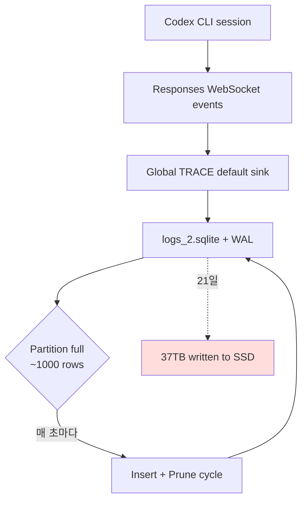

코딩 에이전트는 백그라운드에서 무엇을 쓰고 있는지 사용자가 거의 모른다. 그 사각지대를 정면으로 들춰낸 GitHub 이슈가 6월 14일에 올라왔고, 8일 뒤인 6월 22일에 패치됐다. OpenAI 공식 [Codex CLI](https://github.com/openai/codex)(터미널에서 LLM에게 코드 작업을 시키는 OpenAI의 공식 도구) 사용자가 평소처럼 켜둔 사이에 로컬 SSD에 **21일간 37TB가 기록됐다**. 추정 연간 약 **640TB**. 소비자용 SSD의 보증 수명(TBW, 'Terabytes Written'이라 부르는 메이커가 명시한 누적 쓰기량 한계)이 1TB짜리 기준 대체로 600TB 안팎이라, 1년이면 SSD 한 개를 통째로 다 깎는다.

이슈는 [openai/codex#28224](https://github.com/openai/codex/issues/28224)에 보고돼 HN 프런트페이지 상단(422점)에 올랐고, 패치 PR 두 개가 6월 22일 머지되며 로깅 오버헤드 약 85%가 사라졌다.

## 무엇이 폭주했나

문제는 Codex 내부의 **피드백 로그 SQLite 파일**(`logs_2.sqlite`와 짝꿍 WAL 파일)이었다. SQLite의 WAL(Write-Ahead Log, 변경분을 먼저 별도 파일에 쌓아두고 나중에 본 DB에 반영하는 방식)이 끊임없이 새 기록을 받아 본 DB와 동기화·정리하기를 무한 반복했다.

원인은 한 줄로 요약된다 — **전역 TRACE 레벨 로깅이 기본값으로 박혀 있었다**. TRACE는 보통 디버깅 깊이 들어갈 때만 켜는 가장 시끄러운 로그 단계인데, 이게 Codex 의존 라이브러리·내부 프로토콜 페이로드까지 전부 포함해서 무차별로 SQLite에 박혔다.

이슈 본문이 공개한 진단 숫자가 인상적이다.

- 실제 보존 행 수: **506K~681K** (정리 후 남은 양)
- AUTOINCREMENT 카운터: **5.5B 초과** (insert된 총 행)
- 비율: **약 1만 배 차이** — 5,500,000,000건 넣고 600,000건 남기는 churn(끊임없이 넣고 빼는 회전)

TRACE 로그가 유지 데이터의 **70.7%**, 그중 단일 endpoint `codex_api::endpoint::responses_websocket` 하나만 **527.4 MiB**를 차지했다. OpenTelemetry(분산 시스템 추적·메트릭 표준 라이브러리)가 같은 이벤트를 거울처럼 다시 기록해 추가로 25.3% 더 부풀렸다.

## 패치는 어떻게 했나

머지된 두 PR이 다른 방향에서 문제를 잘랐다.

[#29432 *Stop logging every Responses WebSocket event*](https://github.com/openai/codex/pull/29432)는 성공한 WebSocket 응답마다 전체 페이로드를 TRACE로 남기던 코드를 제거했다. 작성자 jif-oai에 따르면 바쁜 스레드에서 1,000행짜리 로그 파티션이 **수 초** 만에 다 차서 곧바로 정리 사이클로 들어가는 게 핵심 트리거였다. 카운터·duration·timing 같은 핵심 관측 데이터는 유지하고, 매번 풀 페이로드를 박는 부분만 잘랐다.

[#29457 *Filter noisy targets from persistent logs*](https://github.com/openai/codex/pull/29457)는 영속 로그 sink가 끌어들이는 target을 화이트리스트 기준으로 필터링하도록 바꿨다. 의존 라이브러리들이 자기 TRACE 로그를 Codex DB까지 흘려넣지 못하게 막은 것이다.

두 패치 합쳐 **로깅 오버헤드 약 85% 감소** — 즉 같은 사용 패턴이라도 21일 37TB가 약 5.5TB대로 떨어진다. 여전히 작지 않지만, 1년 SSD 수명 안에서 한 자릿수 퍼센트 수준이라 보통 사용자에게는 사실상 무해한 범위다.

## 왜 이게 일반 관심거리인가

코딩 에이전트는 점점 더 오래 켜둔다. 텔레메트리·세션 기록·디버그 로그가 늘어나는 건 자연스럽다. 하지만 그 누적량을 **사용자가 자기 OS 도구로 모니터링할 의무**가 있다는 가정은 평범한 개발자에게 부담스럽다. 보통은 패키지를 깔면 "알아서 합리적으로 동작하리라" 기대한다.

이번 버그가 의미하는 건 두 가지다.

첫째, **로깅 sink의 기본값은 가장 보수적인 레벨이어야 한다.** TRACE는 옵트인이 맞다. 디폴트가 TRACE라면 한 명의 개발자가 잠깐 디버깅 모드를 켜놓고 잊은 게 아니라, 출시 빌드 전체가 그 상태로 나간 셈이 된다.

둘째, **SQLite WAL 자체는 죄가 없다.** 문제는 그 위에 쌓이는 트래픽 양을 누가 정하느냐다. 동일한 WAL 메커니즘으로도 적정 레벨 로그면 1년 1GB도 안 되게 운영된다. 잘못 설계된 logger 한 줄이 아래쪽 스토리지 계층을 통째로 끌고 들어간 사례다.

코딩 에이전트 시장 전체가 비슷한 종류의 사각지대를 안고 있을 가능성이 크다. SSD 수명 같은 외부에서 보이지 않는 비용은, 사용자가 직접 `du -sh ~/.codex` 한 번 쳐보기 전에는 드러나지 않는다.

## 출처

- [openai/codex#28224 — Codex logging bug may write TBs to local SSDs](https://github.com/openai/codex/issues/28224)
- [PR #29432 — Stop logging every Responses WebSocket event](https://github.com/openai/codex/pull/29432)
- [PR #29457 — Filter noisy targets from persistent logs](https://github.com/openai/codex/pull/29457)
- [Hacker News 토론](https://news.ycombinator.com/item?id=48626930)
