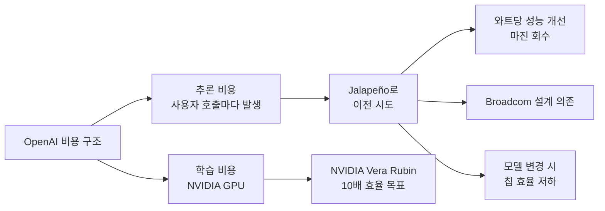

AI 모델을 돌리려면 그래픽 카드(GPU)가 필요하다. 사람의 뇌가 신호를 동시에 수십억 군데 전달해야 하는 일을 컴퓨터로 흉내 내려면 평범한 CPU 한 개로는 한참 모자라고, 작은 계산을 수천 개씩 동시에 처리하는 GPU가 있어야 한다. 그 GPU 시장의 95% 이상을 차지하는 회사가 NVIDIA다. ChatGPT를 한 번 돌릴 때마다 OpenAI는 NVIDIA에 돈을 낸다.

그 구도가 어제(2026-06-24) 한 단계 흔들렸다. OpenAI가 자기 손으로 설계한 첫 칩 **Jalapeño(할라피뇨)**를 발표했다. 제조 파트너는 Broadcom. 학습용이 아니라 **추론(inference) 전용** 칩이고, 회사 표현으로는 "현존하는 최고 수준 칩 대비 와트당 성능이 훨씬 좋다"고 한다([TechCrunch](https://techcrunch.com/2026/06/24/openai-unveils-its-first-custom-chip-built-by-broadcom/)). 구체적인 숫자는 아직 공개되지 않았고, 칩은 테스트 단계다.

## OpenAI는 어디에 쓸 생각인가

학습(training)과 추론(inference)을 구분해야 의미가 보인다.

- **학습**: GPT-5.5 같은 모델을 새로 만드는 과정. 한 번에 수개월, 수만 장의 NVIDIA H100/B200 GPU가 필요하다. 가장 비싼 단계.
- **추론**: 만들어진 모델에 사용자 질문을 넣고 답을 받는 과정. 사용자 한 명 한 명마다 매번 일어난다. 누적 비용은 학습보다 훨씬 크다.

Jalapeño는 추론 쪽이다. OpenAI는 학습은 당분간 NVIDIA로 계속한다고 밝혔다. 이건 합리적인 선택이다 — 학습용 칩은 만들기 어렵고 한 번 만들어 봐야 한 모델에 몇 달 쓰고 끝이지만, 추론 칩은 ChatGPT를 쓰는 매 순간 가동되므로 비용 절감 효과가 끝없이 누적된다.

OpenAI 표현으로는 **실시간 코딩 모델 운영 비용을 줄이는 데 특히 특화**됐다. 최근 Codex 같은 에이전트형 워크로드가 폭증하면서, 사용자 1명이 한 번 질문에 수십 번 모델을 호출하는 일이 흔해졌다. 추론 비용이 회사 손익을 갉아먹기 시작했다는 신호다.

## 왜 지금이고, 왜 다들 자체 칩으로 가는가

OpenAI는 늦은 편이다. 빅테크 자체 AI 칩의 역사를 정리하면 이렇다.

| 회사 | 칩 | 첫 공개 | 용도 |
|------|-----|---------|------|
| Google | TPU v1 | 2015 | 학습+추론 |
| Amazon | Inferentia | 2018 | 추론 |
| Amazon | Trainium | 2020 | 학습 |
| Microsoft | Maia 100 | 2023 | 학습+추론 |
| Meta | MTIA v1 | 2023 | 추론 |
| OpenAI | **Jalapeño** | **2026** | 추론 |

Google은 이미 11년차 베테랑이다. Anthropic은 자체 칩을 만들지는 않지만 Amazon Trainium에 깊이 결합해 학습한다. 이제 모델 회사 중 NVIDIA에 100% 의존하는 메이저는 없는 셈이 됐다.

이유는 세 가지가 겹친다.

**1. 마진.** NVIDIA H100의 원가 대비 판매가 마진은 70%대로 추정된다. 사용 측에선 이 마진을 NVIDIA에 그대로 헌납하는 것이고, OpenAI 규모면 자체 칩 개발비를 몇 년 안에 회수할 수 있다.

**2. 모델 특화.** 범용 GPU는 다양한 워크로드에 대응해야 해서 트레이드오프가 많다. 자기 모델 구조에 최적화한 칩을 만들면 와트당 성능을 몇 배 끌어올릴 수 있다. Google TPU는 Gemini 학습에 특화돼 있고, Jalapeño는 GPT 계열 추론에 특화될 가능성이 높다.

**3. 공급 안정성.** 2023년 NVIDIA GPU 부족 사태에서 OpenAI는 Microsoft Azure를 통해 우선 할당을 받아야 했다. 자체 칩이 있으면 공급망에서 NVIDIA·TSMC만 신경 쓰면 된다(Broadcom은 설계 파트너).

## Broadcom 의존이라는 새 종속

칩 업계에서 나오는 회의론은 명확하다. **"OpenAI가 설계했다"는 표현이 어디까지 진실이냐**는 의심이다.

Hacker News의 한 칩 회사 CEO는 "RTL freeze(설계 동결)부터 tapeout(공장 의뢰)까지 9개월은 3나노 대형 칩으로는 평범한 수준"이라고 지적했다. Broadcom은 이미 Google TPU와 Amazon Trainium의 핵심 IP 블록·물리 설계·TSMC 협력 부분을 담당해 왔다. 즉 Jalapeño도 Broadcom이 대부분 만들고 OpenAI는 요구사항을 제시한 수준일 가능성이 있다는 것이다.

또 다른 비판은 **타이밍**이다. NVIDIA 차세대 Vera Rubin은 현행 Blackwell 대비 와트당 성능 10배를 목표로 한다(NVIDIA 공식). Jalapeño가 양산에 도달할 시점엔 NVIDIA가 한 세대 더 앞서 있을 수 있다는 우려다. 자체 칩이 NVIDIA를 영원히 따라잡을 수는 없다 — 누구도 NVIDIA만큼 칩 설계에 자본·인력을 쏟지 않는다.

세 번째는 **모델-칩 결합 리스크**. 추론 칩은 특정 모델 구조에 최적화될수록 효율이 좋지만, 모델 아키텍처가 바뀌면 칩이 구식이 된다. GPT-5.5에서 GPT-6.0으로 가면서 attention 구조가 바뀌면 Jalapeño의 회로 일부가 무용지물이 될 수 있다.

## 일반 사용자에게 이게 무슨 의미인가

단기적으론 ChatGPT 응답 속도나 가격이 바로 바뀌지 않는다. Jalapeño는 아직 테스트 단계고, 상용 데이터센터에 깔리려면 1년 이상 걸린다.

중기적으론 **AI 가격 경쟁의 폭이 커진다**. NVIDIA에만 의존하면 빅테크 4사가 모두 같은 원가 구조를 갖게 되지만, 자체 칩으로 비용이 분기하면 가격이 더 빨리 내려갈 가능성이 있다. 이미 DeepSeek·GLM 같은 모델이 API 가격을 절반 이하로 끊고 있는 추세에 자체 칩이 가세하면 압력은 더 강해진다.

장기적으론 **AI 회사의 정체성이 바뀐다**. 모델 회사인 줄 알았던 OpenAI가 수직 통합된 인프라 회사로 변하고 있다. Stargate 데이터센터 프로젝트(500억 달러)와 Jalapeño를 같이 놓고 보면 그림이 명확하다 — OpenAI는 자기 손으로 컴퓨팅 전체 스택을 소유하려 한다. 클라우드 의존(Microsoft Azure)에서 벗어나려는 신호이기도 하다.

NVIDIA 입장에선 매출 자체가 줄지는 않을 것이다. AI 수요 자체가 폭발적으로 늘어서 자체 칩이 늘어도 NVIDIA GPU 매출도 같이 늘어왔다. 다만 **점유율 100% 시대는 끝났다**. 그 변곡점이 오늘 Jalapeño 발표라는 게 시장의 평가다.

## 출처

- [OpenAI unveils its first custom chip, built by Broadcom (TechCrunch)](https://techcrunch.com/2026/06/24/openai-unveils-its-first-custom-chip-built-by-broadcom/)
- [Hacker News 토론 (HN item 48663324)](https://news.ycombinator.com/item?id=48663324)
- [Computer use in Gemini 3.5 Flash (Google Blog)](https://blog.google/innovation-and-ai/models-and-research/gemini-models/introducing-computer-use-gemini-3-5-flash/) — 같은 날 발표된 Google의 에이전트 칩셋 동향 참고
