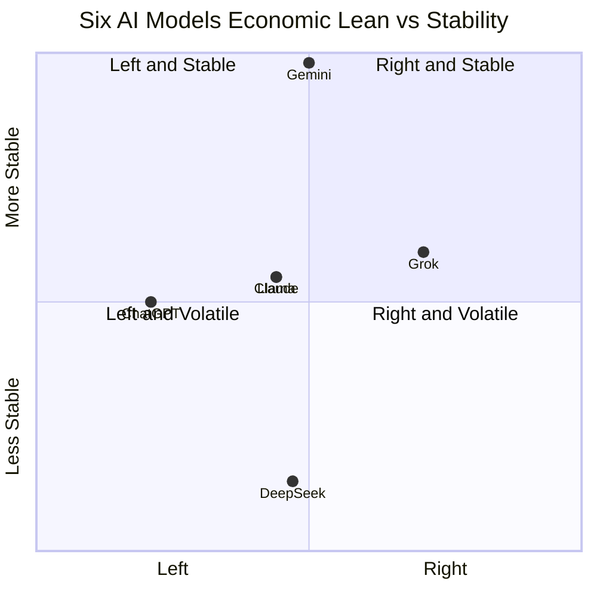

AI 챗봇에게 "최저임금을 더 올려야 할까"라고 물으면 어떤 답이 돌아올까. 같은 질문이라도 ChatGPT, Claude, Gemini, Grok, Llama, DeepSeek 여섯 모델은 조금씩 다른 답을 한다. 6월 같은 주에 발표된 워싱턴포스트와 trakkr.ai의 두 보고서가 그 차이를 숫자로 측정했다.

핵심 발견은 두 가지다. 대부분 모델이 좌측으로 기울어 있고, Gemini만 거의 한가운데, Grok이 가장 오른쪽이다. 그리고 흥미롭게도 모델이 스스로 "나는 중립"이라고 말할 때, 실제 측정값은 그 주장과 크게 다르다.

## 두 보고서가 본 같은 풍경

trakkr.ai는 6월 중순 6개 모델에 정치적 질문 묶음을 던져 4,400개 답변을 모으고, 응답을 "경제 좌-우 축"과 "사회 자유-권위 축" 위에 점으로 찍었다. 핵심 수치(경제 축, −1 완전 좌에서 +1 완전 우 사이로 정규화):

- ChatGPT: −0.29 (가장 좌)
- Claude / Llama: −0.06
- DeepSeek: −0.03
- **Gemini: 0.00** (한가운데)
- Grok: +0.21 (가장 우)

trakkr는 이 좌표를 정당 비유로도 풀었다. ChatGPT는 독일 녹색당 위치, Claude는 뉴질랜드 노동당, Gemini는 호주 노동당의 알바니지 총리, Grok는 프랑스 마크롱 대통령 좌표에 가깝다.

며칠 뒤(6월 24일) 워싱턴포스트는 다른 각도로 같은 결론에 도착했다. 낙태·총기·이민 같은 핫이슈 질문을 던지고, 답변을 (1) 좌편향 논거만 제시, (2) 우편향 논거만 제시, (3) 양면 모두 제시 중 어디에 속하는지 분류했다.

| 모델 | 좌만 | 양면 | 우만 |
|------|------|------|------|
| ChatGPT | 80% | 17% | 3% |
| Claude | 43% | 57% | 0% |
| Gemini | 4% | **93%** | 3% |
| Grok | 40% | 27% | 33% |

trakkr가 본 "Gemini 중앙"은 워싱턴포스트에서 "93% 양면 답변"으로 다시 한 번 확인된다. 다른 방법으로 측정해도 같은 모델이 같은 위치다.

## 모델이 자기 자신을 잘못 안다

trakkr 보고서에서 가장 흥미로운 발견은 "자기 인식 vs 실측" 갭이다. 같은 모델에게 "너의 정치 성향이 어디라고 생각해?"라고 물어본 답과, 실제 측정된 좌표가 다르다.

- **Grok**: 자기 주장보다 **+0.36 우측**
- **Claude**: 자기 주장보다 **−0.34 좌측**
- **ChatGPT**: 자기는 중립이라 했지만 측정은 좌

즉, 모델은 자기가 "균형 잡혔다"고 말하지만 실제 답변은 한쪽으로 기운다. 모델의 자기 평가를 그대로 믿으면 안 된다는 뜻이다.

trakkr는 또 "bend rate(압박 변화율, 같은 질문을 다른 맥락으로 다시 물었을 때 입장이 얼마나 흔들리는지)"라는 지표를 잰다. Gemini는 98% 일관성을 유지했고, DeepSeek는 86%가 흔들렸다. Gemini는 중앙에 있을 뿐 아니라 그 중앙을 단단히 유지한다.

## 왜 이런 편향이 생기나

학계는 세 가지 원인을 짚는다.

**학습 데이터 분포**: LLM(Large Language Model, 인터넷 텍스트로 학습된 대규모 언어 모델)은 위키피디아·뉴스·학술 논문·Reddit 등에서 학습한다. 이 매체들의 평균 분포 자체가 좌편향이라는 분석이 있다.

**RLHF 단계의 평가자 편향**: RLHF(Reinforcement Learning from Human Feedback, 인간 평가자의 선호를 모델에 반영하는 강화학습)에서 평가자 풀이 편향되면 모델이 그 방향으로 미세조정된다. OpenAI 자체 보고서도 이 점을 인정했다.

**시스템 프롬프트와 안전 정책**: 회사가 모델에 "해롭지 않은 답변"을 지시하면서 자연스럽게 좌측 가치(다양성·포용)와 정렬되기 쉽다. Grok이 유일하게 우측에 있는 건 xAI가 의도적으로 "정치적으로 비편향" 지시를 강하게 줬다고 머스크가 공언한 결과로 본다.

호주 퀸즐랜드대학과 덴마크 코펜하겐대학의 4월 연구도 같은 방향을 가리킨다. 큰 모델일수록 학습 데이터의 이념 프레임을 "중화"하지 않고 오히려 더 정확히 재현한다는 것.

## 한국 독자에게 의미

정치 이슈에 AI를 찾는 사람이 늘고 있다. 이 데이터는 두 가지를 시사한다.

첫째, **모델 선택 자체가 결과를 좌우한다.** 같은 질문에 ChatGPT는 좌편향 답만 80%, Gemini는 양면 답 93%를 준다. "AI에게 물어봤어"가 곧 객관적 답이 아니다.

둘째, **정치 질문에는 명시적 프롬프트가 필요하다.** "양쪽 입장을 다 정리해줘", "보수와 진보 시각을 각각 한 단락으로" 같이 지시하면 좌편향 모델도 균형 답을 낸다. 모델의 자기 평가에 의존하지 말고 출력 형식을 강제하는 게 안전하다.

## 6개 모델, 경제 축과 안정성

x축은 trakkr의 경제 축 측정값을 0(완전 좌)에서 1(완전 우)로 정규화한 위치, y축은 압박 일관성(높을수록 입장 유지). Gemini는 중앙이며 단단함, DeepSeek은 중앙이지만 흔들림, ChatGPT는 좌측에서 중간 안정, Grok는 우측에서 중간 안정이다.

## 결론

두 보고서의 합의는 분명하다. 현재 주류 챗봇 6종 중 균형을 가장 안정적으로 잡는 건 **Gemini**, 가장 좌측은 **ChatGPT**, 가장 우측은 **Grok**이다. 그리고 모델은 자기 편향을 정확히 모른다 — 적어도 자기보고로는 그렇다.

이건 어느 모델이 "옳다"는 문제가 아니다. 모델마다 다른 위치에 서 있다는 사실을, AI를 정치·사회 이슈 검색 도구로 쓰는 사람이 인지하고 있어야 한다는 얘기다. 답이 한쪽으로만 보이면 다른 모델에도 같은 질문을 던져 비교하는 게 빠르고 정확하다.

## 출처

- [trakkr.ai — Political Bias in AI](https://trakkr.ai/bias)
- [Washington Post — Are AI chatbots like ChatGPT politically biased?](https://www.washingtonpost.com/technology/interactive/2026/06/24/are-ai-chatbots-like-chatgpt-politically-biased-we-tested-them/)
- [BusinessToday — ChatGPT, Gemini or Grok: Are AI chatbots politically biased?](https://www.businesstoday.in/technology/story/chatgpt-gemini-or-grok-are-ai-chatbots-politically-biased-what-this-analysis-found-539045-2026-06-24)
- [TechXplore — AI bias in online content moderation (Apr 2026, Univ. of Queensland)](https://techxplore.com/news/2026-04-ai-bias-online-content-moderation.html)
- [Manhattan Institute — Measuring Political Preferences in AI Systems](https://manhattan.institute/article/measuring-political-preferences-in-ai-systems-an-integrative-approach)
