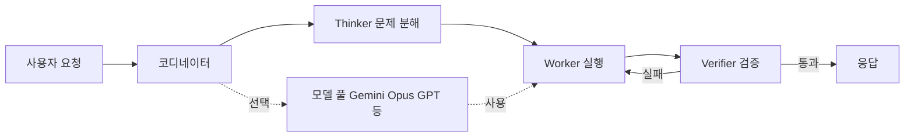

식당 주방에는 보통 셰프 한 명이 한 요리를 끝까지 책임진다. 그런데 일부 호텔 주방은 다르다. 한 명이 야채를 썰고, 다른 한 명이 굽고, 또 다른 한 명이 마지막에 맛을 본다. 누구를 어디에 배치할지 결정하는 사람도 따로 있다. 결과적으로 한 사람이 다 하는 것보다 빠르고 안정적이다.

도쿄 스타트업 **Sakana AI**가 6월 27일 공개한 **Fugu**가 그런 호텔 주방 방식을 AI에 적용했다. 사용자는 API 호출 한 번을 보내지만, 뒤에서는 여러 모델이 역할을 나눠 일한다. 그리고 코드 작성 벤치마크 **SWE-Bench Pro**(실제 GitHub 이슈를 모델이 풀게 시키고 단위 테스트로 채점하는 평가)에서 GPT-5.5보다 25% 가까이 높은 점수를 받았다. 이게 지금 핫한 이유는 **Anthropic 수출 금지 2주 만의 첫 비미국 frontier 대안 모델**이기 때문이다.

## 구조 — TRINITY와 Conductor

Fugu는 두 편의 자체 논문을 기반으로 한다.

**TRINITY**는 가벼운 코디네이터(coordinator, 어떤 모델에게 어떤 일을 시킬지 결정하는 상위 모델)가 작업을 **Thinker / Worker / Verifier** 세 역할로 쪼개 분배한다. Thinker는 문제를 분석하고, Worker가 실제 코드·계산을 수행하고, Verifier가 결과를 검증한다. 코딩·수학·추론 작업마다 다른 모델 조합이 활성화된다.

**Conductor**는 강화학습(reinforcement learning, 모델이 시행착오로 보상을 최대화하는 행동을 배우는 방법)으로 코디네이터를 학습시킨다. "어떤 상황에 어떤 모델을 부르고 어떻게 자연어로 지시할지"를 데이터로 배워간다. 사람이 미리 if-then 룰을 짜는 게 아니다.

핵심은 **사용자가 모델 선택을 안 한다**는 점이다. ChatGPT나 Claude를 쓸 때 우리는 매번 "Opus 쓸까 Sonnet 쓸까"를 고민한다. Fugu는 그 결정을 코디네이터가 자동으로 내린다.

## 점수 — SWE-Bench Pro에서 25% 우위

Fugu가 공개한 벤치마크 결과는 다음과 같다(높을수록 좋음).

| 모델 | SWE-Bench Pro |
| --- | --- |
| **Fugu Ultra** | **73.7** |
| GPT-5.5 | 58.6 |
| Opus 4.8 | 비교 라인업 포함, 수치 미공개 |
| Gemini 3.1 Pro | 비교 라인업 포함, 수치 미공개 |

**SWE-Bench Pro**는 단순 코딩 문제가 아니라 실제 오픈소스 저장소의 실 버그를 패치하라고 시키고 유닛 테스트로 통과 여부를 본다. 자율 코딩 능력을 보는 가장 까다로운 벤치마크 중 하나다. 73.7은 frontier급 점수다.

다만 주의할 점이 있다. Fugu 공식 발표문에는 **"Fable 5와 Mythos Preview는 Fugu 풀에 포함되지 않는다 — 공개적으로 접근할 수 없기 때문"**이라는 문장이 있다. Anthropic의 최신 모델 두 종은 미국 정부의 수출 통제 대상이라 Fugu가 끌어 쓸 수 없다. 비교 대상에서도 빠졌다.

이게 우연이 아니다. Sakana 대변인은 출시 타이밍이 "전적으로 우연"이라고 했지만, 트럼프 행정부가 **Mythos**와 **Fable 5**의 비미국 접근을 차단한 게 2주 전이다. TechCrunch는 같은 날 360(중국 사이버보안 회사)이 **Tulongfeng**이라는 Mythos급 모델을 공개했다고 보도했다. 같은 흐름이다.

## 가격 — GPT-5.6 Sol과 동일하게 책정

Fugu Ultra의 API 가격은 **100만 토큰당 입력 $5 / 출력 $30**이다. 어제 OpenAI가 공개한 **GPT-5.6 Sol**(미국 정부 사전 심사를 통과한 파트너만 우선 사용 가능한 차세대 모델)과 동일한 가격이다. 컨텍스트가 272K 토큰을 넘어가면 가격이 올라간다.

구독제도 있다. Standard $20/월, Pro $100/월, Max $200/월. ChatGPT Plus와 Claude Pro의 가격대를 의식한 라인업이다.

흥미로운 정책 하나: **여러 모델이 동시에 활성화돼도 사용료는 가장 비싼 모델 한 개 기준으로만 청구된다**. 멀티에이전트가 비용 폭증의 원인이 되는 일반적 패턴을 피하려는 설계다. Anthropic Claude의 **Task** 툴(주 에이전트가 자식 에이전트를 띄워 병렬 작업을 시키는 도구)을 써본 사람은 토큰비가 곱셈으로 증가하는 걸 경험해봤을 텐데, Fugu는 정액으로 묶었다.

## 일본어 능력

질적 사례 하나가 발표문에 있다. 고전 일본어 가나(かな) 문자의 읽기 순서를 추정하는 작업에서 Fugu Ultra는 **normalized edit distance 0.80**을 받았다. 비교 대상 모델들은 0.24에 그쳤다. 일본 대학·문화재 디지털화 같은 영역에서 미국 모델이 잘 못하는 부분이다.

이건 **지역 특화 학습 데이터의 효과**를 보여주는 좋은 예다. 같은 종류의 격차가 한국어 한자 혼용 문서, 중국어 고전 문헌, 인도 산스크리트에도 존재한다. 미국 모델 의존이 풀린 자리에 각 지역 모델이 들어가는 구조적 시작점이다.

## 한국은 어디에

비슷한 자리에 한국 모델이 보이지 않는다. LG AI Research의 **Exaone**(LG가 자체 개발한 한국어 특화 모델 시리즈), Naver의 **HyperCLOVA X**, Kakao의 **Kanana**가 있지만 글로벌 비교 벤치마크에서 frontier 라인업과 직접 겨루는 발표는 최근 1년간 없었다. 도메인 특화 B2B에 집중하는 모양새다.

Sakana는 정반대 전략이다. 처음부터 영어 SWE-Bench Pro에서 GPT를 잡으러 갔고, 일본어는 차별화 포인트로 곁들였다. Anthropic 한국지사 6월 오픈, OpenAI Sol 미국 정부 게이트키핑 같은 흐름이 겹치면서 "한국이 자국 frontier 모델 트랙을 가져가야 하나"라는 질문이 다시 무게를 갖는다.

## 결론

수출 통제는 한 시장이 두 개의 시장으로 갈라지는 신호다. Sakana Fugu는 그 분기점에서 첫 비미국 frontier 대안이 어떻게 생겼는지를 구체적으로 보여줬다. 단일 모델이 아니라 멀티에이전트 오케스트레이션, frontier 벤치마크 경쟁력, 지역 특화 데이터 차별화의 세 축을 한 패키지로 묶었다. 이 패턴이 다음 해 한국·중국·인도의 모델 발표에서 반복될 가능성이 크다.

## 출처

- Sakana AI 공식 발표 (Fugu): https://sakana.ai/fugu/
- Sakana AI 출시 비교 자료: https://sakana.ai/fugu-release/
- TechCrunch — Asian AI startups launch Mythos-like models: https://techcrunch.com/2026/06/27/asian-ai-startups-launch-mythos-like-models-as-anthropics-export-ban-drags-on/
- Nikkei Asia — Japan's 'Sakana Fugu' multiagent AI scores well: https://asia.nikkei.com/business/technology/artificial-intelligence/japan-s-sakana-fugu-multiagent-ai-scores-well-against-fable-5-gpt-5.5
- Sakana Fugu GitHub: https://github.com/SakanaAI/fugu
