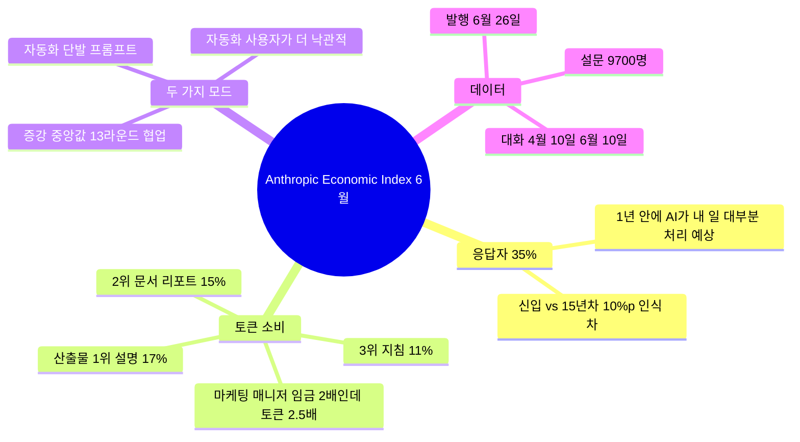

"내 일 1년 안에 AI가 대신할까?" 직장인이라면 한 번쯤 자문해 본 질문이다. Anthropic이 2026년 6월 26일 공개한 Economic Index June 2026 리포트가 이 질문에 직접 답한다. Claude(앤트로픽이 만든 대형 언어 모델 챗봇 — 한국에서도 SK텔레콤 협력 등으로 인지도가 빠르게 올라간 모델) 사용자 약 9,700명을 설문한 결과, **3명 중 1명 이상(35%+)이 "12개월 안에 AI가 내 업무 대부분 또는 거의 전부를 처리할 수 있을 것"**이라고 답했다.

작년만 해도 같은 질문에 "5년 뒤"라고 답하던 사람이 다수였다. 1년 만에 "5년" → "1년"으로 인식이 압축된 셈이다.

## 누가 더 빨리 올 거라 보나 — 신입 vs 15년차

흥미로운 건 경력에 따라 인식이 갈린다는 점이다. 리포트 인용 그대로 옮기면:

> "People with at least 15 years of experience put that share of tasks AI can do roughly 10 percentage points lower than those in their first year of work."

15년차 이상이 신입보다 **10%p 낮게** 예상한다. 보통 "신입이 AI를 더 두려워한다"고 해석되지만 거꾸로 읽을 수도 있다. 15년차는 자기 일의 디테일—맥락 인식, 판단, 상황적 추론—을 매일 다루기 때문에 "이건 AI가 못 한다"고 구분할 줄 안다. 신입은 자기 업무의 어디까지가 AI 대체 가능한지 아직 가늠하지 못해 막연히 "거의 다"라고 보는 경향이 있다는 해석이다.

이건 한국 직장인에게도 같은 신호다. **AI 대체 위협을 정확히 평가하려면 자기 업무를 잘게 쪼개서 봐야 한다.** "내 직무 전체가 사라진다"는 추상적 공포보다, "이 보고서 초안은 AI가 80% 처리 가능, 그러나 임원 보고용 톤·정치적 판단은 본인 몫"처럼 잘게 나누는 방식이 현실 평가에 가깝다.

## 직군별 사용량 — 토큰이 곧 의존도

리포트의 또 다른 수치: 마케팅 매니저는 에디터보다 임금이 약 2배 높지만 **Claude 토큰은 약 2.5배** 더 쓴다. 토큰(token, AI 모델이 텍스트를 처리하는 최소 단위)을 많이 쓴다는 건 그 직군이 AI를 일상 작업에 깊게 끌어들였다는 의미다.

가장 많이 만들어지는 산출물은 다음 세 종류다.

- **설명(Explanations) — 17%**: 개념·코드·문서를 풀어 설명해 달라는 요청.
- **문서·리포트(Documents and reports) — 15%**: 보고서·기획서 초안 작성.
- **지침(Guidance) — 11%**: "이럴 땐 어떻게 해야 하나"식 행동 가이드.

한국 사무직이 평소 하는 일의 큰 비중도 이 세 가지다. 즉 토픽이 바뀐 게 아니라 **누가 초안을 만드냐**가 바뀌고 있다.

## 자동화 vs 증강 — 낙관도가 갈린다

리포트는 AI 사용 방식을 두 모드로 구분한다.

- **자동화(Automation)**: 한 번 시키고 결과를 받는 방식. 사람이 거의 개입 안 함.
- **증강(Augmentation)**: AI와 13라운드씩 주고받으며 결과를 함께 다듬는 방식.

블로그 글 작성 Claude Code 세션은 **단일 프롬프트**로 끝나는 자동화 패턴이 많고, 일반 채팅·Cowork 세션의 중앙값은 **13라운드** 협업이다. 두 모드 모두 의미가 있지만, Anthropic이 짚은 결론은 의외다.

> "자동화된 방식으로 Claude를 사용하는 사람들이 가장 낙관적이며, 임금·고용 안정성에서 긍정적 영향을 기대합니다."

자동화에 더 깊이 들어간 사람일수록 자기 임금이나 고용에 대해 더 낙관적이라는 결과다. "AI에 일 시키니까 내가 더 가치 있는 일에 집중하게 됐다"는 사용자 패턴이 우세한 것으로 보인다. 단, 이는 자기 보고이므로 실제 임금·고용 데이터로 검증되기 전까지는 신중하게 봐야 한다.

## 한국 독자가 봐야 할 지점

이 리포트의 가치는 "AI가 일자리 빼앗는다 vs 안 빼앗는다" 양극 논쟁이 아니라, **자기 업무의 어느 부분이 어떤 방식으로 영향받는지**를 구체 수치로 보여준다는 데 있다.

- 한국 마케팅·콘텐츠·문서 작성 직군은 이미 토큰 소비 상위로 들어와 있을 가능성이 높다. 작년 대비 사용량 추이를 점검해 볼 만하다.
- 자기 직무를 큰 덩어리로 보지 말고 잘게 쪼개 평가하라는 신호—15년차의 인식이 더 정확하다는 데이터—는 직장인 모두에게 유효하다.
- 자동화 모드를 적극 쓰는 사용자가 더 낙관적이라는 점은 "AI를 잘 쓰는 사람이 결국 자기 자리를 지킨다"는 통념과 일치한다. 단, 이건 자기 보고 기반이라 향후 임금 데이터로 확인이 필요하다.

1년 뒤 같은 리포트가 35%를 50%로 갱신할지, 아니면 "역시 사람 일은 안 줄었다"고 한 발 물러설지가 다음 관전 포인트다.

## 출처

- Anthropic, "Anthropic Economic Index June 2026 report", 2026-06-26 — https://www.anthropic.com/research/economic-index-june-2026-report
