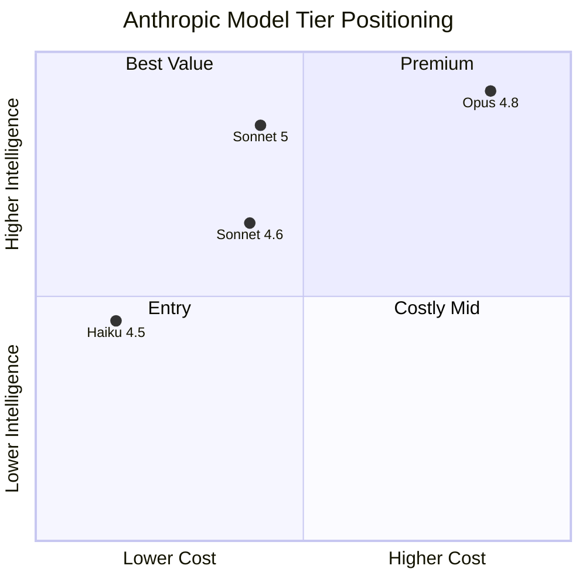

Anthropic이 2026년 6월 30일 Claude Sonnet 5(클로드 소넷 5, Anthropic의 중간급 LLM)를 공개했다. Anthropic의 모델은 보통 3개 라인으로 나뉜다 — Haiku(작고 빠른 모델), Sonnet(균형형 중간 모델), Opus(최상위 모델). 이번 발표의 핵심은 새 Sonnet의 성능이 같은 회사의 최상위 모델인 Opus 4.8에 근접했다는 점이다. 같은 가격대(중간급)는 그대로 두고 능력만 끌어올린 것이라, "어느 티어를 골라야 하나"라는 사용자 결정 자체를 흔드는 변화다.

## 성능: Opus 4.8을 따라잡았다는 주장

Anthropic의 공식 발표문은 두 가지 agentic 벤치마크를 콕 집어 언급했다.

- **BrowseComp**: 웹 브라우징 능력 평가
- **OSWorld-Verified**: 컴퓨터(GUI) 조작 능력 평가

두 벤치마크 모두에서 Sonnet 5는 직전 세대인 Sonnet 4.6을 능가하고, Opus 4.8에 "근접한" 점수를 받았다고 표기했다. 구체 수치는 발표문에 없지만 외부 평가도 일관된다. Artificial Analysis가 운영하는 Intelligence Index(여러 벤치마크를 합산해 한 숫자로 환산한 지표)에서 Sonnet 5는 53점으로 226개 모델 중 1위에 올랐다. 추론·도구 사용·코딩·지식 작업 — Anthropic이 강조한 네 영역 모두 개선됐다는 게 발표문의 요지다.

여기서 "근접"이라는 단어를 곧이곧대로 받아들이지 않아도 된다. 실제 차이가 어느 정도인지는 SWE-bench Verified(GitHub 실제 이슈 해결 벤치마크)나 Aider(LLM 코딩 실력 평가) 같은 세부 벤치마크 수치가 추가로 공개돼야 가늠된다. 다만 "Sonnet 가격대"와 "Opus 성능"이라는 두 축이 묶이기 시작했다는 신호는 분명하다.

## 가격: 도입가 vs 정가, 그리고 토크나이저 변경

Sonnet 5의 가격은 두 단계로 발표됐다.

- **도입 가격 (2026년 8월 31일까지)**: 입력 100만 토큰당 $2, 출력 100만 토큰당 $10
- **정가 (9월 1일 이후)**: 입력 $3, 출력 $15

문제는 같은 발표에서 **토크나이저(입력 텍스트를 모델이 처리할 토큰 단위로 쪼개는 모듈)도 바뀌었다**는 것이다. Anthropic은 "같은 입력 텍스트가 이전 Sonnet 대비 1.0배에서 1.35배 더 많은 토큰으로 처리될 수 있다"고 명시했다. 즉 표 위 단가는 그대로 봐도 실제 청구액은 텍스트당 최대 35%까지 더 나올 수 있다는 뜻이다. "가격 동결"이 아니라 "사실상 인상"으로 받아들이는 게 안전하다.

컨텍스트 윈도우(한 번에 모델에 넣을 수 있는 입력 길이)는 1M(약 100만) 토큰을 유지한다. 책 한 권 분량을 그대로 넣어도 되는 크기로, 직전 세대와 같다.

## 티어 경계가 흐려지는 패턴

이번 변화가 흥미로운 건 단발성 이벤트가 아니라는 점이다. 2025년 가을 출시된 Claude Haiku 4.5도 직전 세대 Sonnet 4.5와 거의 동급 성능을 더 싸게 제공했다. 이번엔 그 한 칸 위에서 같은 일이 벌어진 셈이다.

(점 위치는 발표문·외부 평가 기반 추정. 정확한 좌표는 세부 벤치마크 공개 후에 확정됨.)

도식에서 보이듯, Sonnet 5는 가로축(가격)을 거의 그대로 둔 채 세로축(성능)만 올렸다. Opus와의 사이에 작은 틈만 남는다. 일반 사용자 입장에서 Opus를 굳이 골라야 할 이유는 (a) 최상급 성능이 정말 필요한 어려운 추론·연구, (b) 안전 정책상 더 엄격한 검증이 걸린 영역(Anthropic은 사이버보안 평가에서 Sonnet 5가 Opus보다 낮다고 명시) 정도로 좁아진다.

## 시사점

세 가지 변화가 동시에 일어나고 있다.

1. **모델 티어 사이 결정이 단순해진다.** 일반 작업이면 "그 시점 Sonnet"이 거의 항상 정답에 가깝다. Opus는 진짜 어려운 작업·연구·코딩 한정 옵션으로 좁아진다.
2. **가격은 표 단가 말고 토크나이저까지 봐야 한다.** 이번 1.0-1.35배 토큰 증가는 표면 단가만 비교하던 사용자가 놓치기 쉬운 함정이다.
3. **회사들의 발표 패턴이 바뀐다.** 단발 출시 < 라인업 사이 위치 재정렬. 한 모델을 띄우는 게 아니라 "Sonnet 가격으로 Opus급"처럼 라인 사이 관계를 재정의하는 방식이 메시지의 중심이 됐다.

다음에 OpenAI나 Google이 어떻게 받아칠지가 관전 포인트다. 비슷한 라인 정리(GPT-5.6 → 5.7로 중간급 끌어올림, Gemini Flash가 Pro에 근접)가 6-8월 사이에 따라올 가능성이 높다 — 이건 추측이지만, 작년 가을의 모델 가격 곡선과 같은 패턴이 한 번 더 반복될 거라는 추측이다.

---

## 출처

- Anthropic, "Claude Sonnet 5" (2026-06-30): https://www.anthropic.com/news/claude-sonnet-5
- Artificial Analysis, "Claude Sonnet 5 benchmark results": https://artificialanalysis.ai/models/claude-sonnet-5
- Hacker News 토론: https://news.ycombinator.com/item?id=48736605
