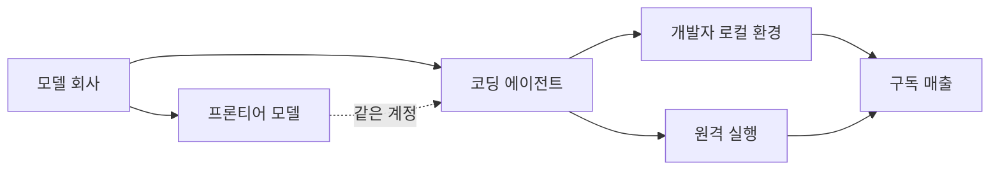

터미널이나 IDE 안에서 개발자 대신 코드를 읽고 고치고 실행까지 해주는 프로그램을 "코딩 에이전트"라고 부른다. 대표적으로 Anthropic이 만든 Claude Code(클로드 코드, 터미널에서 돌아가는 AI 코딩 비서)와 OpenAI가 만든 Codex CLI가 있다. 지난 6월 30일 여기에 세 번째 주자가 합류했다. 중국 Z.AI(구 Zhipu AI, 오픈 가중치 LLM 시리즈인 GLM을 만드는 칭화대 출신 회사)가 자체 코딩 에이전트인 **ZCode**를 공개한 것이다. 커뮤니티 반응이 뜨거워 Hacker News 상위권에 하루 이상 걸려 있다.

## 무엇이 나왔나

ZCode는 GUI(그래픽 인터페이스) 데스크톱 앱이다. macOS·Windows·Linux 3종을 하루에 같이 냈다. Claude Code처럼 순수 CLI(터미널 명령어 기반)는 아니고, 겉모습은 OpenAI Codex의 데스크톱 UI에 더 가깝다. HN 댓글에서는 "손 아이콘, 텍스트 입력창 사용법, 사이드바 스타일이 Codex와 1:1로 똑같다"는 지적이 나왔다.

핵심 특징 몇 개를 정리한다.

- **GLM-5.2 딥 통합**: Z.AI가 6월 중순 공개한 오픈 가중치 모델 GLM-5.2(추론 벤치마크 종합에서 GPT-5.5 고추론 모드와 사실상 동률에 오른 모델)를 기본 백엔드로 사용한다. off-peak 시간대에는 사용량 1.5배 크레딧을 준다.
- **다중 모델 지원**: GLM 전용이 아니라 Claude·GPT 등 다른 API도 붙일 수 있다. 다만 GLM에 최적화가 집중돼 있다.
- **원격 실행**: SSH 또는 Docker 컨테이너에서 코드를 돌릴 수 있다. 로컬 파일 시스템 밖에서 안전하게 격리하려는 용도.
- **메신저 봇 트리거**: WeChat·Feishu·Telegram 세 채널에서 원격으로 작업을 걸 수 있다. 사용자가 자리에 없어도 봇으로 태스크를 던지는 구조.

가격은 세 단계다. Lite $16.20/월, Pro $64.80/월, Max $144/월. Anthropic의 Claude Max($200) 대비 20% 저렴하다.

## 왜 지금 이게 의미 있나

세 가지 결이 겹쳐 있다.

**첫째, "모델 회사가 곧 에이전트 회사"라는 흐름이 뚜렷해졌다.** Anthropic이 Claude Code를 자기 모델과 묶어 팔고, OpenAI가 Codex를 자기 모델에 최적화한 것과 정확히 같은 패턴을 Z.AI가 반복하고 있다. 개발자 툴은 모델 가치를 사용자에게 직접 전달하는 채널이라, 프론티어 급 모델을 낸 회사라면 대부분 이 조합으로 갈 가능성이 높다.

**둘째, 오픈 가중치 + 클로즈드 툴이라는 절묘한 조합이다.** GLM-5.2 모델 자체는 MIT 라이선스 오픈 가중치라 누구나 다운로드해 자기 GPU에서 돌릴 수 있다. 하지만 ZCode 앱은 클로즈드 소스다. 커뮤니티는 이미 zcode-open-bridge(비공식 MCP·ACP 연동 프로젝트)나 zcode-linux(Linux 빌드 포팅) 같은 우회 프로젝트를 만들고 있다. 모델은 열되 툴 접점은 닫아 구독료를 받는 이 구도는 Meta의 Llama 전략과도, 중국의 다른 오픈 모델 회사들과도 다른 3-way 절충이다.

**셋째, 신뢰 이슈가 첫 걸림돌로 등장했다.** HN 댓글 상위권은 "중국 소유 시스템이 파일 시스템 전체 권한을 갖는 게 괜찮은가"라는 우려로 채워졌다. 반대편에서는 "Claude Code나 Codex도 결국 같은 권한을 요구한다. 오히려 오픈소스 대안(OpenCode, Pi 등)이 있는데 굳이 클로즈드를 왜 쓰냐"는 반론이 나왔다. 어느 쪽이든 코딩 에이전트가 개인 개발자 컴퓨터에서 도는 특성상 신뢰가 다음 전선이 된다는 점은 분명해졌다.

## 한국 개발자에게 의미

한국 시장 관점에서 두 가지가 눈에 띈다. 하나는 가격. GLM-5.2가 Claude Opus에 근접한 성능이라는 커뮤니티 평가가 유지된다면, ZCode Pro $64.80은 Claude Max $200 대비 3배 이상 저렴한 대안이 된다. 두 번째는 Telegram 봇 트리거 기능. 국내 개발자 중 텔레그램을 원격 제어 채널로 쓰는 사례는 이미 흔한데, 이걸 공식 기능으로 지원하는 코딩 에이전트는 처음이다.

다만 신중해질 부분도 있다. 코딩 에이전트는 개인 저장소·자격증명·명령어 실행 권한을 다 요구하는 프로그램이라 벤더 신뢰가 결정적이다. Z.AI가 어떤 텔레메트리를 걷어가는지, 데이터 이관 정책이 어떤지는 공식 문서에 아직 자세히 나와 있지 않다. 사용해볼 만한 시점이지만 프로덕션 저장소 접근은 뒤로 미룰 수 있다.

## 출처

- ZCode 공식 페이지: <https://zcode.z.ai/cn>
- Hacker News 토론: <https://news.ycombinator.com/item?id=48751752>
- GLM-5.2 벤치마크(Artificial Analysis): <https://artificialanalysis.ai/>
- 커뮤니티 우회 프로젝트: <https://github.com/tizerluo/zcode-open-bridge>, <https://github.com/unixsysdev/z-code-app>
