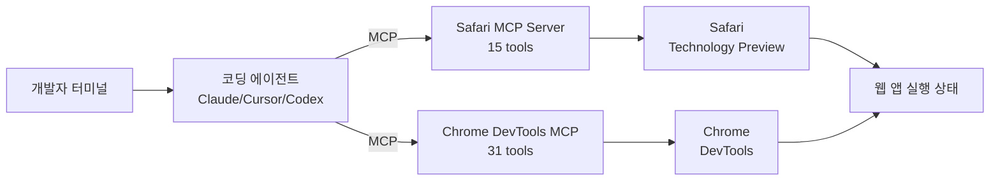

7월 첫째 주에 애플과 구글이 나란히 같은 방향의 발표를 냈다. 애플은 7월 1일 Safari Technology Preview 247에 "Safari MCP 서버"를 넣었고, 같은 시기 구글 크롬 팀의 `chrome-devtools-mcp`는 GitHub 트렌딩에 오르며 4만 5천 스타를 넘겼다. 두 진영이 각자의 브라우저에 **AI 에이전트가 페이지를 직접 조작·검사할 수 있는 창구**를 하나씩 낸 것이다.

여기서 등장하는 MCP(Model Context Protocol, Anthropic이 2024년 말 공개한 오픈 표준. AI 모델이 외부 도구·데이터에 접근하도록 도구 카탈로그를 서버 형태로 노출하는 프로토콜)는 원래 파일 시스템·데이터베이스·API 같은 백엔드 자원을 대상으로 시작했다. 이번엔 그 서버 대상이 브라우저 그 자체로 옮겨왔다. 사용자가 보고 있는 웹 페이지, 열려 있는 탭, 방금 발생한 네트워크 요청 — 이런 라이브 상태를 AI에게 전부 넘기는 구조다.

## 사파리 쪽에 뭐가 붙었나

WebKit 팀이 공식 블로그에서 밝힌 사파리 MCP 서버의 도구 목록은 15개다. 각각 카테고리로 나눠 보면 대략 이렇다.

- **탐색·검사**: 열린 탭 목록 조회, 페이지 콘텐츠 추출, 스크린샷 캡처, 뷰포트 크기 설정
- **DOM 조작**: 특정 요소 클릭·타이핑, 폼 제출, 다이얼로그 응답
- **JS 실행**: 임의 JavaScript 코드를 페이지 문맥에서 실행하고 결과 수신
- **네트워크 관찰**: 최근 네트워크 요청 목록, 응답 헤더·본문 조회
- **콘솔 접근**: `console.log` 등 콘솔 출력 스트리밍

Claude·Cursor·Cline 같은 **아무 MCP 클라이언트**나 이 서버에 붙일 수 있다. 개발자가 터미널에서 코딩 에이전트에게 "지금 로컬 서버 페이지 로그인이 안 돼, 왜 그런지 봐줘" 정도의 요청만 하면, 에이전트가 사파리 창을 확인하고 콘솔을 읽고 네트워크 요청을 뒤져서 원인을 짚어 오는 시나리오가 목표다. 창 전환 없이 터미널 안에서 브라우저 디버깅이 끝나는 그림이다.

한 가지 명확한 제약이 있다. **macOS 전용**이고 iOS 사파리는 대상이 아니다. 그리고 Safari Technology Preview(정식 사파리보다 앞선 개발자용 프리뷰 빌드)에만 들어갔기 때문에 일반 사용자는 당장 쓸 일이 없다. 하지만 애플이 웹킷 블로그에 정식 발표를 걸었다는 자체가 정책 방향의 신호다.

## 크롬 쪽에서 벌어진 일

구글 크롬 팀이 만든 `chrome-devtools-mcp`는 별도 npm 패키지로 배포되고, GitHub 스타 45.5k에 이미 196개 프로젝트가 의존한다. 노출 도구는 31개로 사파리보다 많고, 특히 **성능 트레이스 기록**과 **메모리 프로파일**까지 열어 놨다는 게 차이다. 크롬 팀은 "코딩 에이전트가 웹 앱 성능을 자동으로 감사한다"는 시나리오를 겨냥한 것으로 보인다.

## 왜 지금 한꺼번에

두 회사가 같은 주에 우연히 유사한 물건을 낸 게 아니다. 배경엔 두 가지 흐름이 겹쳐 있다.

첫째, **코딩 에이전트가 개발자 워크플로우의 표준 도구가 됐다**. Claude Code·Cursor·Cline·GitHub Copilot 에이전트 모드가 지난 1년 사이 자리 잡았고, 이들이 코드를 쓰는 것뿐 아니라 실행·디버깅까지 처리한다. 그러려면 브라우저를 봐야 한다. Playwright·Puppeteer를 매번 스크립트로 감싸는 방식은 에이전트에게 무겁다.

둘째, **MCP가 오픈 표준으로 자리 잡으면서 브라우저 벤더가 채택하기 쉬워졌다**. Anthropic이 시작했지만 지금은 OpenAI Codex, Google Gemini, Cursor, Microsoft VS Code Copilot이 모두 MCP 클라이언트를 지원한다. 자기 브라우저에 서버를 하나 넣으면 이 모든 AI 도구가 한 번에 붙는다.

## 일반 독자에겐 어떤 의미

당장 아무 사용자나 "AI가 내 브라우저 조작함"을 체감하진 않는다. Safari MCP는 개발자용 프리뷰이고, Chrome DevTools MCP도 개발자 도구 카테고리다. 하지만 그 뒤에 오는 파장은 결국 일반 사용자한테도 온다.

- **Anthropic·OpenAI 에이전트가 웹 태스크를 진짜로 처리하기 시작한다**. 예약 잡기, 계정 만들기, 폼 채우기 같은 반복 웹 작업을 사람이 브라우저에서 하는 대신 에이전트가 사용자의 실제 브라우저 세션에서 하는 그림. 사용자의 쿠키·로그인 상태를 그대로 쓰기 때문에 별도 로그인 자동화가 필요 없다.
- **웹 앱 QA·버그 리포트가 자동화된다**. "이 페이지 이상해요"라고 스크린샷 한 장만 던지면 에이전트가 페이지 로드, 콘솔 에러, 네트워크 실패까지 다 모아 리포트를 만든다.
- **보안 리스크가 새로 열린다**. AI가 사용자의 로그인된 세션에서 임의 JS를 실행할 수 있다는 건, 프롬프트 주입(prompt injection, 신뢰할 수 없는 웹 페이지 내용이 AI 에이전트에게 몰래 지시를 넣는 공격) 한 방으로 결제·이체·비밀번호 변경까지 가능해진다는 뜻이다. 사파리·크롬 둘 다 이번 릴리스에서 확인 다이얼로그를 필수화했지만, 어디까지 사용자가 무감각해질지는 앞으로의 문제다.

## 결론

브라우저는 여전히 사람이 웹을 만나는 표면이지만, 이제 그 표면 위에 AI 에이전트도 나란히 앉기 시작했다. 사파리와 크롬이 같은 주에 각자의 MCP 서버를 낸 건 우연이 아니라 코딩 에이전트가 실제 개발 흐름에서 브라우저를 요구해서다. 그리고 그 흐름은 결국 일반 웹 자동화·비서형 에이전트로 흘러 내려온다. 관심 있는 방향은 "어떤 브라우저가 AI에 더 열려 있느냐"보다 **누가 프롬프트 주입과 세션 도용을 먼저 안전하게 막느냐**가 될 가능성이 크다.

## 출처

- [Introducing the Safari MCP Server for Web Developers — WebKit Blog](https://webkit.org/blog/18136/introducing-the-safari-mcp-server-for-web-developers/) (2026-07-01)
- [chrome-devtools-mcp — GitHub](https://github.com/ChromeDevTools/chrome-devtools-mcp)
- [Model Context Protocol — Anthropic Introduction](https://www.anthropic.com/news/model-context-protocol)
