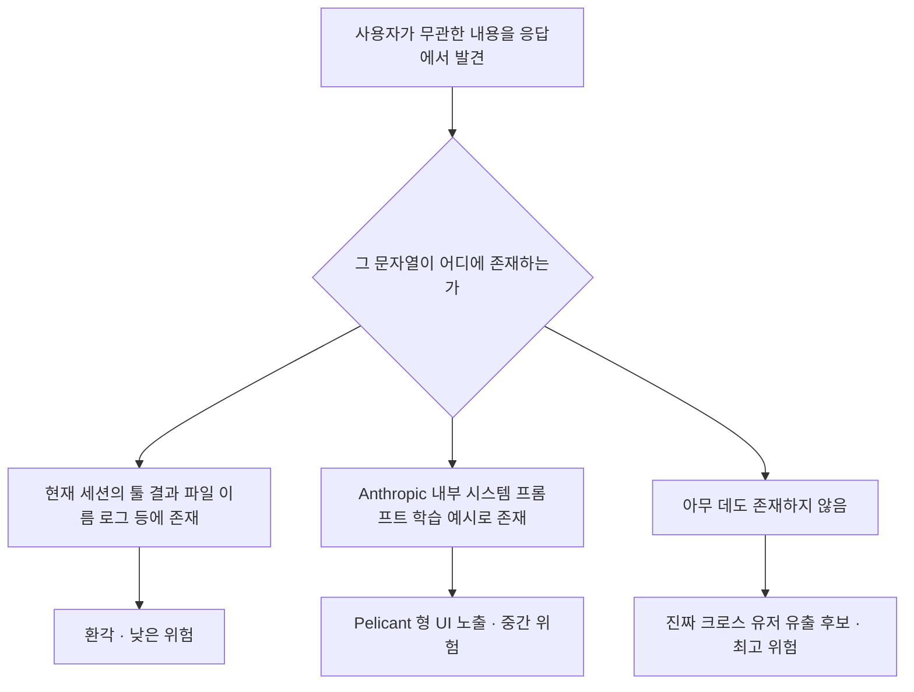

7월 4일 새벽, 한 개발자가 Anthropic의 `claude-code` 저장소에 이슈 #74066을 열었다. Enterprise ZDR(Zero Data Retention, 세션 데이터를 저장하지 않고 다른 워크스페이스와 격리하겠다는 기업용 계약) 워크스페이스에서 Claude Code로 업무를 진행하던 중, 갑자기 Claude가 "마인크래프트 사원 벽돌은 무엇으로 할까요?"라고 자신 있게 물어왔다는 것이다. 화면 히스토리 어디에도 그런 얘기를 한 적이 없다. 리포트한 사용자는 세 가지 시나리오를 의심했다. 같은 팀 동료 세션이 새어들어온 것인지, 컨슈머 플랜의 다른 사용자 데이터가 Enterprise 격리를 뚫고 넘어온 것인지, 아니면 뭔가 다른 문제인지.

몇 시간 만에 Hacker News 상위로 갔고 유사 경험 댓글이 쏟아졌지만, 파고 보면 그림이 그렇게 단순하지 않다.

## 원본 리포트가 담은 장면

원본 스크린샷에는 Claude가 "이전 오염 때문에 정리하고 진행하겠다"며 사용자가 시킨 적 없는 마인크래프트 사원 설계 주제를 자연스럽게 이어가는 대화가 담겼다. 환경은 macOS, Claude Code 2.1.199, Sonnet 5. 등록자는 시작 디렉터리와 실제 작업 디렉터리가 다르고 세션 중간에 대화 압축(compaction)이 있었다는 점을 자기 설정의 별난 부분으로 명시했지만, 마인크래프트 주제는 그 설정과 무관하다고 분명히 했다.

## 스레드에 쏟아진 유사 사례

이슈 스레드에 다른 개발자들이 붙인 경험들이다.

- 동일 계정의 **모바일 Claude 세션**에서도 재현됐다는 보고. 공통점은 Sonnet 5, 5분 이상 유휴 뒤 첫 응답(캐시 미스로 추정되는 순간).
- 별도 컨슈머 계정에서 자기 프로젝트가 아닌 것 같은 **기능 사양 조각**이 삽입돼 예상과 다른 코드가 만들어졌다는 사례.
- 사용자가 대화에서 언급한 적 없는 **친구의 실제 위치**를 Claude가 "근처에 상점이 있다"며 언급. 같은 사무실 다른 사람도 Claude를 쓰는 상황이었다.
- 툴 결과에 사용자가 호출한 적 없는 **가짜 MCP(Model Context Protocol, LLM에 외부 도구를 연결하는 오픈 표준) 서버 인증 요구**와 다른 사용자의 `CLAUDE.md`처럼 보이는 문서가 삽입됐다는 리포트도 있다.

각기 다른 문자열이지만 패턴은 하나로 수렴한다. "내가 시키지 않은 내용이 세션에 들어와 있다."

## 반박: 진짜 유출이 아닐 가능성 두 갈래

같은 스레드 안에서 다른 개발자들은 반대 진단을 냈다.

**첫째, 순수 환각 가능성.** 원본 세션이 Python 가상환경 파일 목록을 훑는 도구를 호출했는데, 그 목록에 Pygments 패키지의 `minecraft.py` 렉서 파일이 포함돼 있었다. Claude가 파일명 문자열 `minecraft`를 컨텍스트에서 이어붙여 사원 얘기를 지어냈을 가능성이 크다는 지적이다. 툴 결과에 등장한 임의 문자열이 모델 응답의 주제를 오염시키는 유형의 환각은 이미 잘 알려진 실패 모드다.

**둘째, "Pelicant 케이스" 전례.** 최근 보안 연구자 노페러이터(noperator)가 Claude의 deep research 기능에서 이상한 헤더 텍스트를 발견한 사건이 있다. 제1차 세계대전 질문에 Windows 업데이트 경고, "펠리컨이 자전거 타는 SVG를 그려라" 같은 완전 무관한 문구가 h2 요소에 5-10% 확률로 숨어 렌더링됐다. Anthropic 조사 결론은 "다른 사용자 데이터가 아니라, 모델 행동 학습용으로 시스템 프롬프트에 박아둔 자체 예시 쿼리가 UI 레이어에서 잘못 노출된 것"이었다. 겉보기엔 유출처럼 보였지만 실은 회사 내부 프롬프트 조각이었다는 케이스다. 이번 사건도 UI 필터가 놓친 내부 컨텍스트가 튀어 들어왔을 가능성이 남아 있다.

## 시나리오 판별 흐름

같은 증상을 놓고 서로 다른 원인이 가능하다면, 판별의 관건은 "누출된 것으로 보이는 문자열이 어디에 실재하는가"다.

원본 리포트의 마인크래프트 케이스는 C(툴 결과에 실재)에 해당하는 정황이 강하다. 그러나 (a) 다양한 문자열로 여러 사용자가 유사 경험을 보고한다는 점, (b) 같은 Enterprise 계정의 모바일 세션에서도 발생했다는 점은 단순 환각으로만 설명하기 애매하다. E(진짜 유출)가 완전히 배제된 상태는 아니다.

## Anthropic 반응과 남은 질문

이 글 작성 시점 기준으로 이슈는 Open 상태이고 Anthropic 팀의 공식 답변은 아직 없다. Pelicant 케이스처럼 사후 브리핑이 나올 수도 있고, 다른 결론이 나올 수도 있다.

기업이 Enterprise ZDR을 계약하는 이유는 데이터 격리가 계약 문서에 박히기 때문이다. 이번 진단이 (a) 진짜 크로스 유저 유출이면 격리 아키텍처 재설계와 감사 로그 공개, (b) 시스템 프롬프트가 UI로 노출된 케이스면 필터링 규정 강화, (c) 환각이면 툴 결과 문자열이 모델 응답 신뢰도에 얼마나 영향을 주는지에 대한 정량 자료 — 어느 결론이 나오든 벤더가 명확히 사후 브리핑을 할 유인이 있다. 반대로 침묵이 길어지면 Enterprise 계층의 계약 신뢰가 훼손된다.

민감한 코드를 다루는 팀 입장에서 당장 취할 대응은 두 가지다. 무관한 컨텍스트가 응답에 등장하면 세션 로그 안에서 그 문자열을 먼저 검색해 유래를 확인하는 것, 공식 진단이 나오기 전까지 재현 조건과 로그를 보존해 두는 것. Anthropic 답변이 나오면 이 페이지를 갱신한다.

## 출처

- GitHub Issue #74066, `anthropics/claude-code`, 2026-07-04: https://github.com/anthropics/claude-code/issues/74066
- 노페러이터의 Pelicant 조사: https://noperator.dev/posts/pelicant
- Hacker News 스레드 (동 이슈 상위 노출), 2026-07-04
