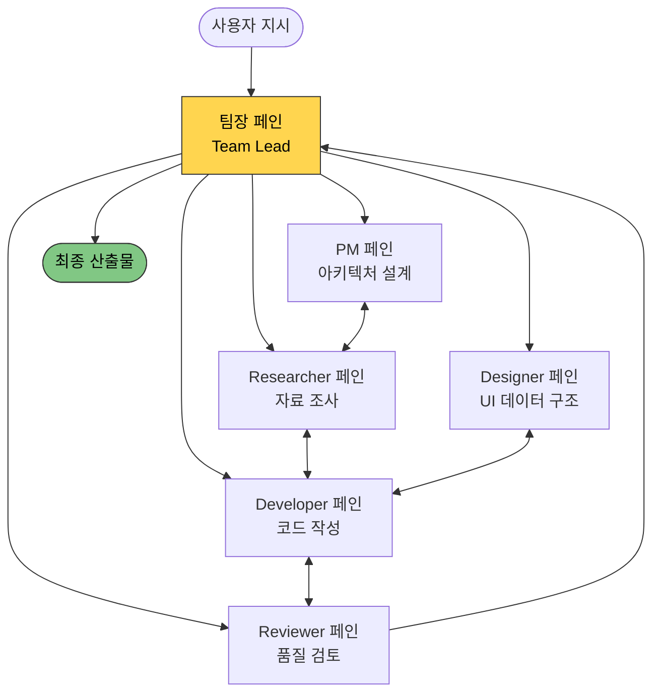

터미널 한 화면을 여섯 칸으로 쪼개 놓고, 각 칸마다 AI 코딩 어시스턴트가 한 명씩 들어가 서로 메시지를 주고받으며 일을 나눠 한다. 한 명은 팀장 노릇을, 한 명은 조사를, 한 명은 코드를, 한 명은 리뷰를 맡는다. 최근 개발자 커뮤니티에서 화제가 된 "Claude Code 멀티 페인 운영" 패턴의 풍경이다.

Claude Code(Anthropic이 만든 터미널 기반 AI 코딩 어시스턴트)를 단일 세션으로 쓰는 사람은 많지만, 한 사람이 여러 인스턴스를 동시에 띄워 팀처럼 굴리는 건 비교적 새로운 운영 방식이다. 이를 가능하게 하는 도구가 tmux(터미널 멀티플렉서, 한 터미널을 여러 영역으로 분할해 각각 독립된 셸을 돌리는 도구)다. 분할된 각 영역을 pane(페인)이라 부르는데, 페인마다 별도 Claude Code 인스턴스를 띄우면 각자 다른 컨텍스트 윈도우와 다른 역할을 갖게 된다.

## 왜 단일 세션으로는 부족한가

이 패턴이 등장한 배경에는 단일 Claude Code 세션의 세 가지 한계가 있다. 첫째, 컨텍스트 윈도우가 한 작업의 모든 파일·로그·대화 기록을 떠안다 보니 긴 작업 후반엔 초반 지시를 잊거나 압축에 시간을 쓴다. 둘째, 코드를 짜는 동안 사용자가 다른 질문을 던질 수 없다. 한 세션은 한 번에 한 흐름밖에 못 다룬다. 셋째, Anthropic Max 플랜의 5시간 윈도우 한도(2026년 5월 6일자로 확대된 기준에서도 메시지 수 제한이 존재)를 한 세션이 모두 빨아먹으면 다른 작업이 막힌다.

페인을 쪼개 인스턴스를 분리하면 각자 독립된 컨텍스트와 진행 흐름을 갖게 된다. 한 명이 빌드를 돌리는 동안 다른 한 명에게 새 지시를 내릴 수 있다는 뜻이다.

## 6-페인 팀 구조의 실제 예

한국어 가이드에서 자주 인용되는 6-페인 구성은 이런 식이다. 팀장 페인이 사용자의 지시를 받아 작업을 쪼개고, PM이 아키텍처를 설계하고, Researcher가 자료를 조사하고, Designer가 화면이나 데이터 구조를 짜고, Developer가 실제 코드를 작성하고, Reviewer가 결과물을 검토한다. 한 사람이 작은 회사 하나를 돌리는 셈이다.

Anthropic도 이 운영 패턴을 공식 기능으로 정착시켰다. Claude Code 2.1.32 이후의 실험 기능 "Agent Teams"는 환경변수 `CLAUDE_CODE_EXPERIMENTAL_AGENT_TEAMS=1`로 활성화되며, 메인 세션이 Team Lead가 되어 다른 인스턴스(Teammate)를 자동 스폰한다. 핵심은 sub-agent와 달리 teammate끼리 직접 메시지를 주고받는다는 점이다. 공식 문서는 적정 팀 규모로 3~5명을 권장하며, 페인당 5~6개 작업이 효율적이라고 명시한다.

## 어디까지 효과가 있나

Anthropic 엔지니어링 블로그가 공개한 사례는 더 극단적이다. Nicholas Carlini가 16개 Claude 에이전트를 약 2주간 돌려 10만 줄짜리 Rust 기반 C 컴파일러를 만든 프로젝트는, 토큰 비용 약 2만 달러에 출력 토큰 2억 1,400만 개를 썼고 GCC torture 테스트 99% 통과를 기록했다. 에이전트마다 중복 코드 제거·성능 최적화·문서화 등 전문 역할을 부여한 것이 핵심이었다.

다만 한계도 분명하다. 같은 파일을 두 teammate가 동시에 건드리면 덮어쓰기가 난다. 코디네이션 오버헤드 때문에 토큰을 단일 세션 대비 훨씬 많이 쓴다. `/resume`으로 세션을 복원해도 in-process teammate는 같이 살아나지 않는다. 그리고 GitHub 이슈 #46037에는 단일 사용자가 병렬 세션을 3개 이상 띄우면 한 세션은 정상이고 나머지는 429 rate limit를 맞는다는 보고가 올라와 있다.

## 이 패턴이 시사하는 것

멀티 페인 구조는 도구 하나를 더 빠르게 돌리는 기술적 트릭이 아니라, AI 어시스턴트를 다루는 멘탈 모델 자체의 전환에 가깝다. 한 명의 만능 도우미가 아니라 역할이 다른 동료들로 구성된 작은 조직을 운영하는 감각이다. 비전공자에게 시사하는 점은 단순하다. AI를 잘 쓰는 사람의 정의가 한 도구를 깊이 다루는 사람에서 여러 도구·역할을 동시에 지휘하는 사람으로 옮겨가고 있다는 것. 일대일 챗 인터페이스만 보고 있다면 이 변화를 놓치기 쉽다.

## 출처

- [Orchestrate teams of Claude Code sessions — Claude Code Docs](https://code.claude.com/docs/en/agent-teams)
- [Claude Code Multi-Agent tmux Setup — Dariusz Parys](https://www.dariuszparys.com/claude-code-multi-agent-tmux-setup/)
- [Claude Code + TMUX + Remote-Control로 AI 팀 만들기 — wikidocs.net](https://wikidocs.net/347754)
- [Run Multiple Claude Code Sessions — codeagentswarm](https://www.codeagentswarm.com/en/guides/run-multiple-claude-code-sessions)
- [Building a C compiler with a team of parallel Claudes — Anthropic](https://www.anthropic.com/engineering/building-c-compiler)
- [Claude Code is getting higher usage limits, doubled for most users — 9to5Google](https://9to5google.com/2026/05/06/claude-code-is-getting-higher-usage-limits-doubled-for-most-users/)
- [Anthropic API 429 Rate Limit with Multiple Parallel Sessions — GitHub Issue #46037](https://github.com/anthropics/claude-code/issues/46037)
