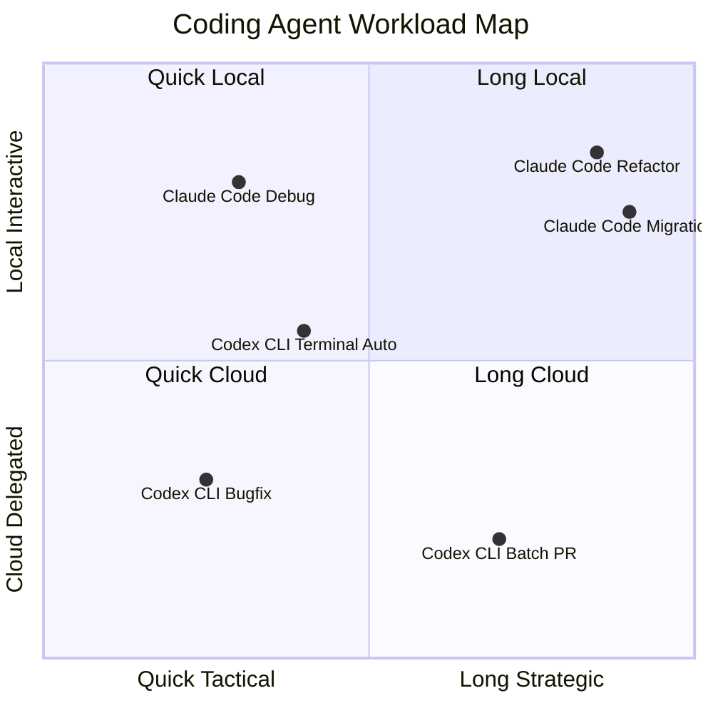

2025년 4월 OpenAI가 Codex CLI를 공개했고, 두 달 앞선 2월에는 Anthropic이 Claude Code를 출시했다. 같은 카테고리—터미널에서 살면서 파일을 읽고 쓰고 명령을 실행하는 코딩 에이전트 하네스(harness, 모델을 둘러싸 도구·권한·루프를 제공하는 외피)—지만 두 도구는 1년 동안 정반대에 가까운 길을 갔다. Claude Code는 로컬 머신에 깊이 들러붙는 "옆자리 동료" 모델을, Codex CLI는 클라우드로 작업을 위임하는 "외주 엔지니어" 모델을 골랐다. 비전공자에게 비유하자면 한쪽은 책상 옆에 앉아 같이 코드를 짜는 사수, 다른 한쪽은 깃허브 이슈를 던지면 PR로 답하는 원격 계약직에 가깝다.

지금이 비교 시점인 이유는 두 가지다. 첫째, 2026년 4월 23일 OpenAI가 GPT-5.5(Codex 백엔드 모델)를 풀어 Codex의 일부 벤치마크가 SOTA(State-of-the-Art, 분야 최고 기록)를 갈아치웠다. 둘째, Anthropic은 같은 분기에 Agent Teams(다수의 Claude Code 세션을 팀으로 엮어 병렬 작업하게 하는 기능)를 정식화했고 5월 6일에는 SpaceX와의 Colossus 1 데이터센터 계약으로 Pro·Max 플랜 5시간 한도를 두 배로 올렸다. 두 도구 모두 단순한 "버전 업"이 아닌 구조 변경급 변곡점을 지난 직후라, 지금 비교가 6개월 뒤에도 어느 정도 유효하다.

## 1. 출시·구조·가격

| 항목 | Claude Code | Codex CLI |
|---|---|---|
| 첫 출시 | 2025-02-24 (Sonnet 3.7와 동시) | 2025-04-16 (TypeScript 초기) |
| 현재 백엔드 | Opus 4.7 / Sonnet 4.6 (선택) | GPT-5.5 / GPT-5.5 Pro (4월 24일 출시) |
| 코어 구현체 | Node.js CLI + IDE 확장 | Rust(2025-06 재작성) + Node CLI 어댑터 |
| 라이선스 | 상용 (모델 잠금) | 상용 + CLI는 Apache 2.0 일부 공개 |
| 구독 진입점 | Pro $20, Max $100/$200 | ChatGPT Plus $20, Go $8, Pro/Business |
| 거버넌스 | Anthropic 단일 운영 | OpenAI 단일 운영, GitHub 696 릴리스/12개월 |

Codex CLI가 6월에 TypeScript에서 Rust로 재작성된 점은 내부 동작 속도뿐 아니라 샌드박싱 구현 폭을 결정했다(뒤에서 다시). Claude Code는 같은 시기 Node 기반을 유지하면서 Skills·Hooks·MCP(Model Context Protocol, 외부 데이터·API를 표준 인터페이스로 붙이는 프로토콜) 등 확장 레이어를 위에 쌓는 방향을 택했다. 한쪽은 코어를 깎고, 다른 쪽은 위에 얹는 식이다.

## 2. 벤치마크 — 누가 어디서 강한가

수치는 2026년 4월에서 5월 초 사이 공개치 기준이다. 단순 우열보다 어떤 작업에서 차이 나는지를 본다.

| 벤치마크 | Claude Code | Codex CLI | 출처 |
|---|---|---|---|
| SWE-bench Verified | 87.6% (Opus 4.7) | 미공개(Verified는 Pro 기준 사용) | NxCode 2026-04 |
| SWE-bench Pro | 64.3% (Opus 4.7) / 55.4% (4.6) | 57.7% (GPT-5.4) / 56.8% (5.3-Codex) | Morphllm 2026-02 |
| Terminal-Bench 2.0 | 65.4% (Opus 4.6) / 82.0%(Mythos 시뮬) | 77.3% (GPT-5.3-Codex) | tbench.ai |
| OSWorld-Verified | 우위 (정확치 비공개) | 열위 | NxCode 종합 |

요약하면 SWE-bench(Software Engineering Bench, 실제 GitHub 이슈 해결률을 측정하는 벤치마크) 계열은 4.7 출시 이후 Claude가 다시 앞선 상태고, 터미널에서 셸 명령을 줄줄이 엮어 푸는 Terminal-Bench 2.0은 Codex가 12점 이상 앞서다 4.7 출시로 격차가 8점 이내로 줄었다. 컴퓨터를 직접 조작하는 OSWorld-Verified는 Claude가 우위다. 거칠게 말해 "코드 변경의 깊이"는 Claude, "셸·CLI 자동화의 폭"은 Codex가 강하다는 패턴이 계속 유지된다.

블라인드 코드 리뷰 평가에서는 Claude Code 출력이 67% 비율로 더 깔끔하다고 평가됐고 Codex는 25%였다(나머지 8%는 동등). 같은 Express.js 리팩터를 Codex로는 약 $15, Claude Code로는 약 $155 들어 끝냈다는 사례도 보고됐다. 토큰 효율은 뒤에서 다시 다룬다.

## 3. 샌드박싱 — 운영체제 레벨의 차이

Codex CLI는 사용자가 시작할 때 세 가지 모드 중 하나를 명시적으로 고른다.

- read-only: 파일 읽기만, 편집·실행은 매번 승인.
- workspace-write(기본): 작업 폴더 안에서 편집·로컬 명령 실행 가능, 그 밖은 차단.
- danger-full-access: 파일·네트워크 경계 모두 해제.

이 경계가 단순 정책이 아니라 OS 레벨에서 강제된다는 점이 특이하다. macOS는 Seatbelt(애플 sandbox-exec 프로파일), Linux는 Landlock(LSM 기반 파일 접근 제한)과 seccomp(시스템 콜 필터)을 결합하고, 실제 격리 셸은 Bubblewrap(bwrap, 사용자 네임스페이스 기반 컨테이너 도구)으로 구성한다. Windows는 PowerShell 직접 실행 시 네이티브 Windows Sandbox, WSL2에서는 Linux 구현을 그대로 사용한다.

이 차이가 실무에 미치는 영향은 두 가지다. 첫째, 모델이 "rm -rf"를 시도해도 작업 폴더 밖이면 OS가 거부한다. 정책 무시·프롬프트 인젝션·환각 가운데 어느 경로로 들어와도 OS 경계는 안 뚫린다. 둘째, 네트워크 차단이 강제되므로 "외부에 데이터 누출" 경로가 줄어든다(workspace-write 기본은 외부 네트워크 차단, danger 모드만 해제).

Claude Code는 다른 길을 택했다. OS 샌드박싱 대신 Hooks(PreToolUse·PostToolUse·UserPromptSubmit 등 라이프사이클 이벤트 훅) + 권한 프롬프트(파일 쓰기·Bash 명령마다 사용자 확인) + Plan 모드(편집을 안 하고 계획만 세우는 단계)를 조합한다. 책임을 사용자 워크플로 쪽으로 옮긴 셈이다. 안전한 환경을 만들고 싶으면 사용자가 직접 Docker 컨테이너로 띄우거나 Hooks로 위험 명령 차단 스크립트를 거는 방식이 권장된다.

같은 "안전"이라는 단어 아래 두 도구가 향한 방향이 다르다. Codex는 "OS가 알아서 막는다", Claude Code는 "사용자가 워크플로로 막는다". 보안팀이 통제 가능한 배포를 원하면 Codex의 OS 강제 모델이 감사하기 쉽고, 신뢰 가능한 단독 사용자가 모든 것을 손에 쥐고 싶으면 Claude Code의 Hooks 모델이 유연하다.

## 4. 도구셋·확장성 — 같은 카테고리, 다른 빌드

Claude Code의 확장 레이어는 다섯 층으로 정리된다.

- CLAUDE.md / Skills: 반복 워크플로를 마크다운 파일로 정의해 슬래시 명령으로 호출.
- MCP: GitHub·DB·임의 API를 표준 프로토콜로 붙이는 외부 도구 연결.
- Subagents: 새 컨텍스트로 독립 실행되는 보조 에이전트, 세부 출력은 격리되고 요약만 메인에 반환.
- Hooks: 라이프사이클 이벤트별 훅 스크립트.
- Agent Teams: 2026년 2월 실험 기능으로 시작해 점진적 일반화. 환경변수 `CLAUDE_CODE_EXPERIMENTAL_AGENT_TEAMS=1` 활성화 후 다중 세션이 메일박스·공유 태스크 리스트로 직접 통신. v2.1.32 이상 필요. 3월 9일에는 이 위에서 동작하는 Claude Code Review가 출시돼 Anthropic 내부 PR 리뷰 커버리지를 16%에서 54%로 끌어올렸다고 공개됐다.

Codex의 확장은 다른 축이다.

- Subagents: Claude의 서브에이전트와 컨셉은 같지만 호출 패턴이 클라우드 작업과 자연스럽게 결합된다.
- Cloud Execution: `codex cloud` 한 줄로 OpenAI 인프라 컨테이너에 격리 작업을 던지고, 작업이 끝나면 GitHub PR로 자동 변환해 돌려준다. 로컬 머신을 안 깨우고도 백그라운드에서 십수 개 작업을 동시에 굴릴 수 있다.
- Skills·MCP·in-app browser·computer use(macOS, 2026-04 추가)·thread automations 등 4월 GPT-5.5 패치와 동시에 따라붙은 일련의 기능들.

차이를 한 줄로 줄이면 Claude Code는 "내 머신에서 더 똑똑한 동료", Codex는 "내 머신과 클라우드 사이를 자유롭게 오가는 에이전트"다. 같은 하네스 카테고리이지만 실행 주소(local vs cloud)와 결합 방식이 다르다.

## 5. 비용·rate limit — 토큰 효율의 그림자

세 가지 사례에서 측정된 토큰 사용량 비교가 자주 인용된다.

- Figma 플러그인 클로닝: Codex 1.49M tokens vs Claude 6.23M (4.2배)
- 스케줄러 앱: Codex 72.5K vs Claude 234.7K (3.2배)
- API 통합 작업: Codex 약 180K vs Claude 약 650K (3.6배)

Claude Code가 토큰을 3-4배 더 쓴다는 패턴이 반복된다. 이유는 "생각을 글로 풀어 쓰는" 경향(extended thinking, 명시적 추론 토큰을 많이 생성)과 더 긴 설명·문서화 출력 때문이다. 같은 결과물을 더 비싸게 사는 셈이지만, 블라인드 평가에서 Claude 출력이 67% 비율로 더 깔끔하다고 평가된 점과 합쳐 보면 "비싸지만 마감이 좋다"는 트레이드오프로 읽힌다.

API 단가도 차이가 크다. GPT-5.3-Codex-Mini가 입력 $1.50 / 출력 $6.00(per 1M tokens), Claude Opus 4.6가 $5.00 / $25.00. 단순 입출력만 보면 Codex가 3-4배 저렴하고, 토큰 사용량 차이까지 합치면 동일 작업당 10배 이상 비용 차이가 보고된 사례도 있다.

구독 한도에서는 5월 6일 Anthropic이 SpaceX Colossus 1 데이터센터(300MW, NVIDIA GPU 약 22만 장) 사용권을 확보하면서 Pro·Max·Team·시트 기반 Enterprise의 5시간 한도를 두 배로 올렸고 피크타임 감축도 제거했다. Codex 쪽은 4월 GPT-5.5와 함께 Plus·Pro·Business·Enterprise·Edu·Go 모두에 400K 컨텍스트가 열렸고 Fast 모드(생성 속도 1.5배, 비용 2.5배)가 추가됐다. 두 진영 모두 한도를 넓히는 방향으로 정렬됐다.

## 6. 작업 유형별 권장

대규모 마이그레이션·멀티파일 리팩터·아키텍처 의사결정은 Claude Code 쪽이 손에 익는다. 컨텍스트가 길고, 출력이 두꺼워 변경 의도가 명확히 남고, Agent Teams로 프론트·백·테스트를 동시에 굴릴 수 있다.

단발 버그픽스·이슈 일괄 처리·PR 자동 생성은 Codex CLI 쪽이 빠르고 싸다. 클라우드 컨테이너에 작업을 던져 두고 다른 일을 하다 PR이 도착하면 검토만 하면 된다. 토큰 효율도 압도적이라 한 달에 PR 수십 개를 양산하는 흐름에 적합하다.

터미널 셸 자동화·DevOps 스크립트·CLI 도구 빌드는 Terminal-Bench 2.0 격차대로 Codex가 측정 가능하게 강하다. 반대로 컴퓨터 직접 조작(브라우저·UI 자동화)은 OSWorld-Verified에서 Claude가 강세를 보이고, Anthropic이 computer use를 일찍부터 다룬 경험치가 누적돼 있다.

학습·탐색·페어 프로그래밍은 Claude Code의 길고 친절한 출력이 쓸모 있다. 빠르게 결과물만 받고 싶으면 Codex가 덜 거슬린다.

## 결론

이 비교를 단순 우열로 결론낼 수는 없다. 두 도구는 같은 카테고리에 들어와서 서로 다른 사용자 흐름을 최적화했다. Claude Code는 "옆자리 동료" 모델로 깊이·정확성·문서화를 가져가고, 그 비용으로 토큰 사용량과 단가를 받아들였다. Codex CLI는 "외주 엔지니어" 모델로 클라우드 위임·토큰 효율·OS 강제 샌드박스를 가져가고, 그 비용으로 일부 작업의 출력 풍부함을 줄였다.

본인이 키보드 옆에 두고 같이 코드를 짜고 싶은 사람인지, 작업 큐에 던져 두고 결과만 받고 싶은 사람인지가 첫 갈림길이다. 보안 통제가 OS 레벨에서 감사 가능해야 하면 Codex, 워크플로 자유도가 우선이면 Claude Code가 자연스럽다. 두 진영이 서로의 좋은 부분을 빠르게 베끼고 있어 6개월 뒤 그림은 또 달라질 가능성이 높다. 다만 그 무렵에도 "로컬 깊이 vs 클라우드 위임"이라는 축은 둘을 가르는 기본 좌표로 남을 것이다.

## 출처

- [Anthropic — Higher limits and SpaceX deal (2026-05-06)](https://www.anthropic.com/news/higher-limits-spacex)
- [9to5Google — Claude Code rate limits doubled (2026-05-06)](https://9to5google.com/2026/05/06/claude-code-is-getting-higher-usage-limits-doubled-for-most-users/)
- [Claude Code Docs — Agent Teams](https://code.claude.com/docs/en/agent-teams)
- [The New Stack — Anthropic multi-agent code review](https://thenewstack.io/anthropic-launches-a-multi-agent-code-review-tool-for-claude-code/)
- [Morphllm — Codex vs Claude Code 2026](https://www.morphllm.com/comparisons/codex-vs-claude-code)
- [NxCode — Claude Code vs Codex CLI 2026](https://www.nxcode.io/resources/news/claude-code-vs-codex-cli-terminal-coding-comparison-2026)
- [NxCode — Claude Mythos benchmarks 2026](https://www.nxcode.io/resources/news/claude-mythos-benchmarks-93-swe-bench-every-record-broken-2026)
- [Northflank — Claude Code vs OpenAI Codex 2026](https://northflank.com/blog/claude-code-vs-openai-codex)
- [OpenAI Developers — Codex Sandbox concepts](https://developers.openai.com/codex/concepts/sandboxing)
- [OpenAI Developers — Codex Security](https://developers.openai.com/codex/security)
- [OpenAI Developers — Codex Changelog](https://developers.openai.com/codex/changelog)
- [OpenAI — Introducing GPT-5.5](https://openai.com/index/introducing-gpt-5-5/)
- [9to5Mac — OpenAI upgrades Codex with GPT-5.5](https://9to5mac.com/2026/04/23/openai-upgrades-chatgpt-and-codex-with-gpt-5-5-a-new-class-of-intelligence-for-real-work/)
- [Codex Blog — Cloud vs Local](https://codex.danielvaughan.com/2026/03/27/codex-cloud-vs-local-when-to-run-in-cloud/)
- [Codex Blog — Multi-agent ecosystem](https://codex.danielvaughan.com/2026/04/09/claude-multi-agent-ecosystem/)
- [SitePoint — Claude Code Agent Teams](https://www.sitepoint.com/anthropic-claude-code-agent-teams/)
- [Vals.ai — Terminal-Bench 2.0 leaderboard](https://www.vals.ai/benchmarks/terminal-bench-2)
- [Scale — SWE-bench Pro Leaderboard](https://labs.scale.com/leaderboard/swe_bench_pro_public)
- [alexop.dev — Claude Code full stack](https://alexop.dev/posts/understanding-claude-code-full-stack/)
